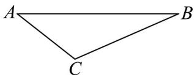
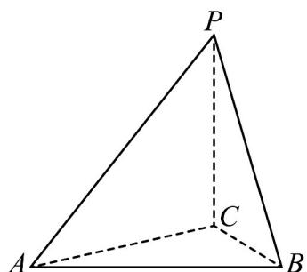
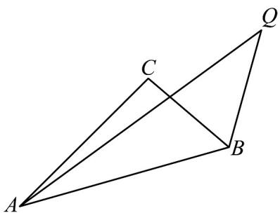
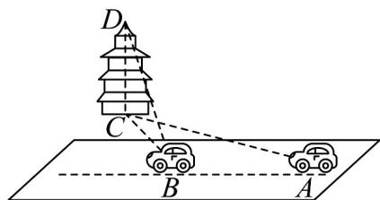
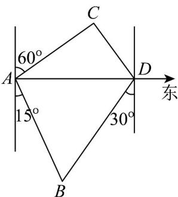
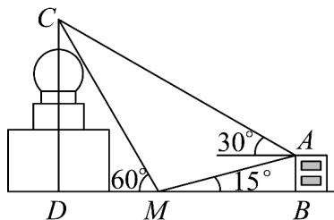

> [!faq]- 《专题07_正弦定理_余弦定理_高效培优期中专项训练_数学人教A版高一必》官方解析
>
> > [!success]- **【答案】** D
>
> > [!note]- **【解析】**
> > 设出发点为 A，向东航行到 B 处后改变航向到达 C
> >
> > 
> >
> > 则 $AB = x$ ， $AC = 30$ ， $BC = 30\sqrt{3}$ ， $\angle ABC = 30^{\circ}$
> >
> > 由正弦定理可得： $\frac{AC}{\sin\angle ABC}=\frac{BC}{\sin\angle BAC}$ ，即 $\frac{30}{\sin30^{\circ}}=\frac{30\sqrt{3}}{\sin\angle BAC}$ ，
> > ∴ $\sin \angle BAC = \frac{\sqrt{3}}{2}$
> >
> > $\therefore \angle BAC = 60^{\circ}$ 或 $120^{\circ}$
> >
> > (1) 若 $\angle BAC = 60^{\circ}$ ，则 $\angle ACB = 90^{\circ}$ ， $\forall ABC$ 为直角三角形，
> >
> > $$
> > \therefore A B = 2 A C = 6 0
> > $$
> >
> > (2) 若 $\angle BAC = 120^{\circ}$ ，则 $\angle ACB = 30^{\circ}$ ，VABC 为等腰三角形，
> >
> > $$
> > \therefore A B = A C = 3 0
> > $$
> >
> > 综上，x 的值为 30 或 60.
> >
> > 故选：D.
> >
> > 52．人类从未停下对自然界探索的脚步，位于美洲大草原点 C 处正上空 300m 的点 P 处，一架无人机正在对猎豹捕食羚羊的自然现象进行航拍．已知位于点 C 西南方向的草从 A 处潜伏着一只饥饿的猎豹，猎豹正盯着其东偏北 $15^{\circ}$ 方向上点 B 处的一只羚羊，且无人机拍摄猎豹的俯角为 $45^{\circ}$ ，拍摄羚羊的俯角为 $60^{\circ}$ ，假设 A，B，C 三点在同一水平面上．
> >
> > (1)求此时猎豹与羚羊之间的距离 AB 的长度；
> >
> > (2)若此时猎豹到点 C 处比到点 B 处的距离更近，且开始以 $40 \, m/s$ 的极限速度出击，与此同时机警的羚羊以 $30 \, m/s$ 的速度沿北偏东 $15^\circ$ 方向逃跑，已知猎豹受耐力限制，最多能持续奔跑 $800 \, m$ ，试问猎豹这次捕猎是否有成功的可能？请说明原因。
> >
> > 【答案】(1)答案见解析
> >
> > (2)不能捕猎成功，原因见解析
> >
> > 【详解】（ $^{1}$ ）由题意作图如下：
> >
> > 
> >
> > 则 $\angle APC = 45^{\circ}$ ， $\angle CBP = 60^{\circ}$ ， $\angle BAC = 45^{\circ} - 15^{\circ} = 30^{\circ}$
> >
> > $$
> > A C = \frac {P C}{\tan \angle A P C} = 3 0 0 \mathrm{m}, B C = \frac {P C}{\tan \angle C B P} = 1 0 0 \sqrt {3} \mathrm{m}
> > $$
> >
> > 由正弦定理 $\frac{AC}{\sin\angle ABC} = \frac{BC}{\sin\angle BAC}$ ，可得 $\sin \angle ABC = \frac{\sqrt{3}}{2}$
> >
> > 因此 $\angle ABC = 60^{\circ}$ 或 $120^{\circ}$
> >
> > 当 $\angle ABC = 60^{\circ}$ 时， $\angle ACB = 90^{\circ}$ ，猎豹与羚羊之间的距离为 $AB = \sqrt{AC^2 + BC^2} = 200\sqrt{3}\mathrm{m}$ ，当 $\angle ABC = 120^{\circ}$ ， $\angle ACB = 30^{\circ} = \angle BAC$ ，猎豹与羚羊之间的距离为 $AB = BC = 100\sqrt{3}\mathrm{m}$ .
> >
> > (2) 由题意作图如下：
> >
> > 
> >
> > 设捕猎成功所需的最短时间为 t，
> >
> > 在 $\triangle ABQ$ 中， $BQ = 30t$ ， $AQ = 40t$ ， $AB = 200\sqrt{3}$ ， $\angle ABQ = 120^{\circ}$
> >
> > 由余弦定理得： $1600t^{2} = 900t^{2} + \left(200\sqrt{3}\right)^{2} - 2\times 30t\times 200\sqrt{3}\times \left(-\frac{1}{2}\right)$
> >
> > 整理得： $7t^{2} - 60\sqrt{3} t - 1200 = 0$
> >
> > 设 $f(t) = 7t^2 - 60\sqrt{3}t - 1200$ ，显然 $f(0) < 0, f\left(\frac{30\sqrt{3}}{7}\right) < 0$ ，
> >
> > 因猎豹能坚持奔跑最长时间为 $\frac{800}{40} = 20\mathrm{s}$ ，且 $f(20) = 2800 - 1200\sqrt{3} - 1200 = 400(4 - 3\sqrt{3}) < 0$ 。
> >
> > ∴猎豹不能捕猎成功。
> >
> > 53. 一辆汽车在一条水平的公路上向正西行驶，如图，到 $A$ 处时测得公路北侧一铁塔底部 $C$ 在西偏北 $30^{\circ}$ 的方向上，行驶 $200\mathrm{m}$ 后到达 $B$ 处，测得此铁塔底部 $C$ 在西偏北 $75^{\circ}$ 的方向上，塔顶 $D$ 的仰角为 $30^{\circ}$ ，则此铁塔的高度为（）
> >
> > 【答案】
> >
> > 
> >
> > A. $\frac{100\sqrt{6}}{3}\mathrm{m}$ B. $50\sqrt{6}\mathrm{m}$ C. $100\sqrt{3}\mathrm{m}$ D. $100\sqrt{2}\mathrm{m}$
> >
> > 【答案】A
> >
> > 【详解】设此铁塔高 $h(\mathrm{m})$ ，根据题意，可得 $\angle CAB = 30^{\circ},\angle CBA = 105^{\circ},\angle DBC = 30^{\circ}$ 在直角 $\triangle BCD$ 中，可得 $BC = \frac{CD}{\tan 30^{\circ}} = \sqrt{3} h$ ，在VABC中，由 $\angle BAC = 30^{\circ},\angle CBA = 105^{\circ},AB = 200$ ，可得 $\angle BCA = 45^{\circ}$ 根据正弦定理，可得 $\frac{\sqrt{3}h}{\sin 30^{\circ}} = \frac{200}{\sin 45^{\circ}}$ ，解得 $h = \frac{100\sqrt{6}}{3} (\mathrm{m})$ ：
> >
> > 故选：A.
> >
> > 54. 一艘渔船航行到 A 处时看灯塔 B 在 A 的南偏东 $15^{\circ}$ ，距离为 $12\sqrt{6}$ 海里，灯塔 C 在 A 的北偏东 $60^{\circ}$ ，距离为 $12\sqrt{3}$ 海里，该渔船由 A 沿正东方向继续航行到 D 处时再看灯塔 B 在其南偏西 $30^{\circ}$ 方向，则此时灯塔 C 位于渔船的（）
> >
> > 【答案】
> >
> > A. 南偏东 $60^{\circ}$ 方向
> >
> > B. 南偏西 $30^{\circ}$ 方向
> >
> > C. 北偏西 $60^{\circ}$ 方向
> >
> > D. 北偏西 $30^{\circ}$ 方向
> >
> > 【答案】D
> >
> > 【详解】如图，
> >
> > 
> >
> > 由题意，在 $\triangle ABD$ 中， $B = 15^{\circ} + 30^{\circ} = 45^{\circ}$ ， $AB = 12\sqrt{6}$ ， $\angle ADB = 60^{\circ}$
> >
> > 由正弦定理得 $\frac{AD}{\sin45^{\circ}}=\frac{AB}{\sin60^{\circ}}=\frac{12\sqrt{6}}{\frac{\sqrt{3}}{2}}=24\sqrt{2}$
> >
> > 所以 AD = 24
> >
> > 在 $\triangle ACD$ 中，因为 $AC = 12\sqrt{3}$ ， $\angle CAD = 30^{\circ}$
> >
> > 由余弦定理得 $CD^2 = AC^2 + AD^2 - 2AC \times AD \times \cos 30^\circ = (12\sqrt{3})^2 + 24^2 - 2 \times 12\sqrt{3} \times 24 \times \frac{\sqrt{3}}{2} = 144$
> >
> > 所以 $CD = 12$
> >
> > 由正弦定理得 $\frac{CD}{\sin 30^{\circ}} = \frac{AC}{\sin \angle CDA}$
> >
> > 所以 $\sin\angle CDA=\frac{12\sqrt{3}\times\frac{1}{2}}{12}=\frac{\sqrt{3}}{2}$
> >
> > 因为 $AD > AC$ ，故 $\angle CDA$ 为锐角，
> >
> > 故 $\angle CDA = 60^{\circ}$ ，此时灯塔 $C$ 位于渔船的北偏西 $30^{\circ}$ 方向。
> >
> > 故选：D.
> >
> > 55. 中卫一中数韵社某同学为了测量学校天文台 $CD$ 的高度，选择附近宿舍楼三楼一阳台，高 $AB$ 为 $(15 - 5\sqrt{3})\mathrm{m}$ ，在它们之间的地面上的点 $M$ （ $B, M, D$ 三点共线）处测得楼顶 $A$ ，天文台顶 $C$ 的仰角分别是 $15^{\circ}$ 和 $60^{\circ}$ ，在阳台 $A$ 处测得天文台顶 $C$ 的仰角为 $30^{\circ}$ ，假设 $AB, CD$ 和点 $M$ 在同一平面内，则该同学可算得学校天文台 $CD$ 的高度为 \_\_\_\_ m.
> >
> > 
> >
> > 【答案】30
> >
> > 【详解】 $\sin 15^{\circ} = \sin (45^{\circ} - 30^{\circ}) = \sin 45^{\circ}\cos 30^{\circ} - \cos 45^{\circ}\sin 30^{\circ} = \frac{\sqrt{6} - \sqrt{2}}{4}$
> >
> > 在直角三角形 $\triangle ABM$ 中， $AM = \frac{AB}{\sin 15^{\circ}} = 10\sqrt{6}$
> >
> > 由题知， $\angle CAM = 45^{\circ}, \angle AMC = 105^{\circ}, \angle MCA = 30^{\circ}$
> >
> > 在 $\triangle AMC$ 中根据正弦定理， $\frac{CM}{\sin 45^{\circ}} = \frac{10\sqrt{6}}{\sin 30^{\circ}}$ ，解得 $CM = 20\sqrt{3}$
> >
> > 于是在VCDM中， $CD=20\sqrt{3}\cos30^{\circ}=30$
> >
> > 故答案为：30
> >
> > <!-- source-part:2 pages:51-56 -->
> >
> > ## 考点 12 正余弦定理的其他应用
