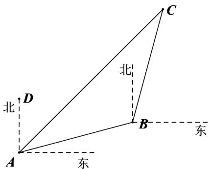

> [!faq]- 《专题07_正弦定理_余弦定理_高效培优期中专项训练_数学人教A版高一必》官方解析
>
> > [!success]- **【答案】** $45^{\circ}$
>
> > [!note]- **【解析】**
> > 设海警船的航行方向是北偏东 $\alpha$ ，
> >
> > 由题知 $\angle BAC = 75^{\circ} - \alpha$ ， $\angle ABC = 105^{\circ} + 15^{\circ} = 120^{\circ}$ ， $AC = 30\sqrt{3} t, BC = 30t$
> >
> > 在 $\vee ABC$ 中，由正弦定理得到 $\frac{30t}{\sin(75^\circ - \alpha)} = \frac{30\sqrt{3}t}{\sin 120^\circ}$ ，得到 $\sin (75^\circ - \alpha) = \frac{1}{2}$ ，
> >
> > 又 $0 < \alpha < 90^{\circ}$ ，所以 $75^{\circ} - \alpha = 30^{\circ}$ ，得到 $\alpha = 45^{\circ}$
> >
> > 
> >
> > 故答案为： $45^{\circ}$
