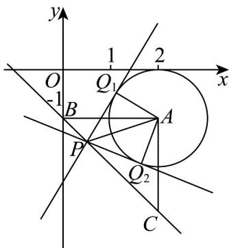

> [!faq]- 《专题09_复数的四则运算_高效培优期中专项训练_数学人教A版高一必修第》官方解析
>
> > [!success]- **【答案】** $[0,2]$
>
> > [!note]- **【解析】**
> > 设 $z_{3} = 2 - \mathrm{i}$ ，其在复平面对应的点为 $A(2, - 1)$
> >
> > 易知 $P(a,b),Q(c,d)$ ， $a + b = -1$ ， $\left|z_2 - 2 + \mathrm{i}\right| = 1$
> >
> > 所以 P 在 $x + y + 1 = 0$ 上，Q 在以 A 为圆心， $^{1}$ 为半径的圆上，
> >
> > 由圆的对称性，不妨令 $PA$ 平分 $\angle Q_{1}PQ_{2}$
> >
> > 即直线 $x + y + 1 = 0$ 上存在点 P 满足 $\angle Q_{1}PA = 30^{\circ}$
> >
> > 如下图所示，显然当 $PQ_{1}$ 与圆相切时， $\angle Q_{1}PA$ 张角最大，
> >
> > 此时可知 $\left|AP\right|=\frac{\left|AQ_{1}\right|}{\sin30^{\circ}}=2$
> >
> > 根据图形可知：设直线 $x + y + 1 = 0$ 与 $y$ 轴的交点为 $B$ ，则 $B(0, - 1)$ ，显然 $\left|AB\right| = 2$
> >
> > 过 $A$ 作 $AC / / y$ 轴交直线 $x + y + 1 = 0$ 于 $C$ ，则 $C(2, - 3)$
> >
> > 易知 $\angle CBA = 45^{\circ}$ ，则 $\forall ABC$ 为等腰直角三角形，即 $\left|AB\right| = \left|AC\right|$
> >
> > 故直线 $x + y + 1 = 0$ 上满足 $\left|AP\right| = 2$ 的点有两个即 $B(0, - 1)$ 或 $C(2, - 3)$
> >
> > 显然当点 P 横坐标小于 $^{0}$ 或大于 2 时，可知圆上不存在点 $Q_{1}$ 满足 $\angle Q_{1}PA = 30^{\circ}$
> >
> > 即不符合题意，故 $a \in [0,2]$
> >
> > 故答案为： $[0,2]$
> >
> > 
