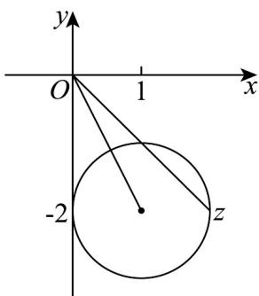

> [!faq]- 《专题09_复数的四则运算_高效培优期中专项训练_数学人教A版高一必修第》官方解析
>
> > [!success]- **【答案】** $\sqrt{5}-1/-1+\sqrt[3]{5}$
>
> > [!note]- **【解析】**
> > 根据复数模的几何意义可知， $\left|z-1+2\mathrm{i}\right|=1$ 表示复平面内以 $(1,-2)$ 为圆心， $^{1}$ 为半径的圆，而 $\left|z\right|$ 表示复数z到原点的距离，
> >
> > 
> >
> > 由图可知， $\left|z\right|_{\min}=\sqrt{1^{2}+\left(-2\right)^{2}}-1=\sqrt{5}-1$
> >
> > 故答案为： $\sqrt{5}-1$
