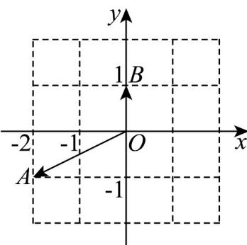

> [!faq]- 《专题09_复数的四则运算_高效培优期中专项训练_数学人教A版高一必修第》官方解析
>
> > [!success]- **【答案】** 
>
> > [!note]- **【解析】**
> > 由题意得，复数 $z_{1} = -2 - \mathrm{i}$ ， $z_{2} = \mathrm{i}$
> >
> > 则 $\frac{z_2}{z_1} = -\frac{\mathrm{i}}{2 + \mathrm{i}} = -\frac{\mathrm{i}(2 - \mathrm{i})}{(2 + \mathrm{i})(2 - \mathrm{i})} = -\frac{2\mathrm{i} - \mathrm{i}^2}{4 - \mathrm{i}^2} = -\frac{1}{5} -\frac{2}{5}\mathrm{i}$
> >
> > 故答案为： $-\frac{1}{5} -\frac{2}{5}\mathrm{i}$
