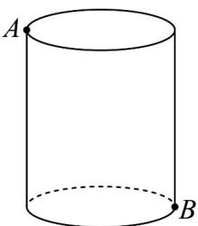
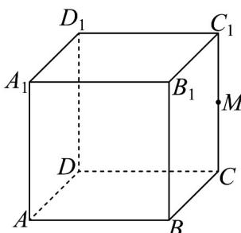

<!-- question-source:start -->
2．（1）如图1，底面半径为 $1cm$ ，高为 $3cm$ 的圆柱，在点A处有一只蚂蚁，现在这只蚂蚁要围绕圆柱，由点A爬到点B，求蚂蚁爬行的最短路线长（ $\pi$ 取3）；

(2) 如图 2，在长方体 $ABCD - A_{1}B_{1}C_{1}D_{1}$ 中，M 是 $CC_{1}$ 的中点， $AB = BB_{1} = 4cm$ ， $BC = 3cm$ ，一只蚂蚁从点 A 出发沿长方体表面爬行到点 M，求蚂蚁爬行的最短路线长.

图1

图2
<!-- question-source:end -->

![[高中/课堂同步/题库/人教A版高中数学同步讲义(2026)/02_必修第二册/期中专项训练+期中模拟卷/专项训练/专题11_基本立体图_柱体_椎体_台体_高效培优期中专项训练_数学人教/_compact/answers/Q00064006A1.md]]
