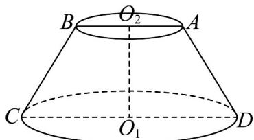

<!-- question-source:start -->
42. 某工厂生产出一种机械零件，如图所示，零件的几何结构为圆台 $O_{1}O_{2}$ ，在轴截面 $ABCD$ 中， $AB = AD = BC = 4\mathrm{cm}, CD = 2AB$

(1)求圆台 $O_{1}O_{2}$ 的高；

(2)求圆台 $O_{1}O_{2}$ 轴截面的面积；

(3)若一只蚂蚁从点 $C$ 沿着该圆台的侧面爬行到 $AD$ 的中点，求所经过的最短路程.
<!-- question-source:end -->

![[高中/课堂同步/题库/人教A版高中数学同步讲义(2026)/02_必修第二册/期中专项训练+期中模拟卷/专项训练/专题11_基本立体图_柱体_椎体_台体_高效培优期中专项训练_数学人教/_compact/answers/Q00064041A1.md]]
