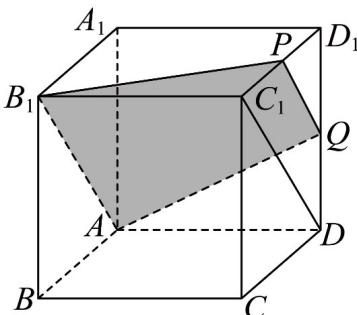

> [!faq]- 《专题11_基本立体图_柱体_椎体_台体_高效培优期中专项训练_数学人教》官方解析
>
> > [!success]- **【答案】** B
>
> > [!note]- **【解析】**
> > 
> >
> > 如图所示：取 $C_1D_1$ 的中点 $P$ ，连接 $PQ, PB_1, AB_1, AQ$ 和 $DC_1$
> >
> > 因为 $P, Q$ 分别是 $C_1D_1, DD_1$ 的中点，所以 $PQ // C_1D$ 且 $PQ = \frac{1}{2} C_1D$
> >
> > 又 $AB_{1} / / C_{1}D$ ，故 $PQ / / AB_{1}$ 且 $PQ = \frac{1}{2} AB_{1}$
> >
> > 故 $A, B_{1}, P, Q$ 四点共面，且四边形 $AB_{1}PQ$ 是过 $Q, A, B_{1}$ 三点的截面，又因为四边形 $AB_{1}PQ$ 是梯形，故选B.
> >
> > 故选 **B**
