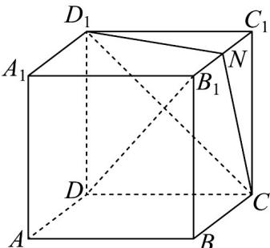
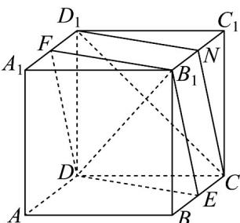

> [!faq]- 《专题11_基本立体图_柱体_椎体_台体_高效培优期中专项训练_数学人教》官方解析
>
> > [!success]- **【答案】** 
>
> > [!note]- **【解析】**
> > 如图，取 BC 的中点 E， $A_{1}D_{1}$ 的中点 F，连接 DE， $B_{1}E$ ， $B_{1}F$ ，FD，
> >
> > 
> >
> > 因为 E，F 分别为 BC， $A_{1}D_{1}$ 的中点，所以 $FD_{1}\parallel B_{1}N$ ， $FD_{1}=B_{1}N$
> >
> > 所以四边形 $FD_{1}NB_{1}$ 是平行四边形，所以 $FB_{1} \parallel D_{1}N$
> >
> > 又因为 $D_{1}N \subset$ 平面 $CND_{1}$ ， $FB_{1} \not\subset$ 平面 $CND_{1}$ ，所以 $FB_{1} \parallel$ 平面 $CND_{1}$
> >
> > 同理 $B_{1}E\|$ 平面 $CND_{1}$
> >
> > 又 $B_{1}E\cap FB_{1} = B_{1}$ ， $B_{1}E$ ， $FB_{1}\subset$ 平面 $FDEB_{1}$ ，所以平面 $FDEB_{1}\parallel$ 平面 $CND_{1}$
> >
> > 即四边形 $FDEB_{1}$ 为 $\alpha$ 截正方体所得截面图形.
> >
> > 由正方体的棱长为 $^{2}$ ，易得四边形 $FDEB_{1}$ 是边长为 $\sqrt{5}$ 的菱形，
> >
> > 对角线即为正方体 $ABCD - A_{1}B_{1}C_{1}D_{1}$ 的体对角线 $B_{1}D = \sqrt{3 \times 2^{2}} = 2\sqrt{3}$
> >
> > 又 $EF = \sqrt{2^2 + 2^2} = 2\sqrt{2}$ ，所求截面的面积 $S = \frac{1}{2} \times 2\sqrt{3} \times 2\sqrt{2} = 2\sqrt{6}$ .
> >
> > 故答案为： $2 \sqrt{6}$
