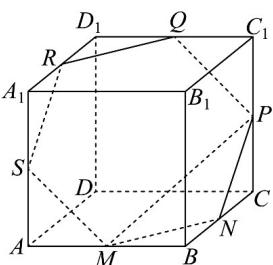
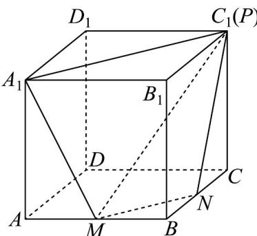
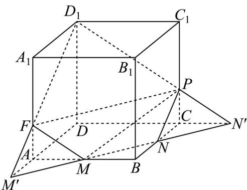

> [!faq]- 《专题11_基本立体图_柱体_椎体_台体_高效培优期中专项训练_数学人教》官方解析
>
> > [!success]- **【答案】** A. 当 $\frac{CP}{CC_1} = \frac{1}{2}$ 时，截面 $\alpha$ 为五边形 B. 当 $\frac{CP}{CC_1} > \frac{1}{2}$ 时，截面 $\alpha$ 只能是六边形 C. 当 $\frac{CP}{CC_1} = \frac{1}{3}$ 时，截面 $\alpha$ 的面积最大 D. 当 $\frac{CP}{CC_1} < \frac{1}{3}$ 时，截面 $\alpha$ 只能是五边形
>
> > [!note]- **【解析】**
> > 对于 $^{A}$ ，当 $\frac{CP}{CC_{1}}=\frac{1}{2}$ 时，分别取 $C_{1}D_{1},A_{1}D_{1},AA_{1}$ 的中点为Q,R,S，如下图所示：
> >
> > 
> >
> > 由正方体性质可得 $MN // RQ$ ，即可得 $MNPQRS$ 为正六边形，
> >
> > 因此当 $\frac{CP}{CC_1} = \frac{1}{2}$ 时，截面 $\alpha$ 为六边形，即 $^{\mathrm{A}}$ 错误；
> >
> > 对于 $\mathbf{B}$ ，如下图：
> >
> > 
> >
> > 当 $\frac{CP}{CC_1} >\frac{1}{2}$ 时，不妨取 $P$ 与 $C_1$ 重合，可知截面 $\alpha$ 只能是四边形 $MNPA_{1}$ ，可知B错误；
> >
> > 对于 $^{C}$ ，延长MN交AD于 $M'$ ，交CD于 $N'$ ，连接 $N'D_{1}$ 交 $CC_{1}$ 于点P，连接 $M'D_{1}$ 交 $AA_{1}$ 于 $P'$ ，如下图所示：
> >
> > 
> >
> > 不妨取正方体的棱长为 $3$ ，易知 $D_{1}P = D_{1}F = \sqrt{13}, FP = 3\sqrt{2}$
> >
> > 可知 $\triangle D_{1}PF$ 为等腰三角形，其底边上的高为 $\sqrt{13 - \frac{9}{2}} = \sqrt{\frac{17}{2}}$
> >
> > 因此其面积为 $S_{\triangle D_1PF} = \frac{1}{2}\times 3\sqrt{2}\times \sqrt{\frac{17}{2}} = \frac{3}{2}\sqrt{17}$
> >
> > 又 $MN = \frac{3}{2}\sqrt{2}, FM = PN = \frac{\sqrt{13}}{2}$ ，可知四变形 $MNPF$ 为等腰梯形；
> >
> > 其高为 $\sqrt{\left(\frac{\sqrt{13}}{2}\right)^2 - \left(\frac{3}{4}\sqrt{2}\right)^2} = \sqrt{\frac{17}{8}}$ ，因此其面积为 $\frac{1}{2} \times \left(\frac{3}{2}\sqrt{2} + 3\sqrt{2}\right) \times \sqrt{\frac{17}{8}} = \frac{9\sqrt{17}}{8}$
> >
> > 此时五边形面积为 $\frac{3}{2}\sqrt{17} +\frac{9}{8}\sqrt{17} = \frac{21}{8}\sqrt{17}\approx 10.8$
> >
> > 当当 $\frac{CP}{CC_1} = \frac{1}{2}$ 时，截面为边长是 $\frac{3}{2}\sqrt{2}$ 的正六边形，其面积为 $6\times \frac{1}{2}\times \left(\frac{3}{2}\sqrt{2}\right)^2\times \frac{\sqrt{3}}{2} = \frac{27\sqrt{3}}{4}\approx 11.7$
> >
> > 显然当 $\frac{CP}{CC_1} = \frac{1}{3}$ 时，截面 $\alpha$ 的面积不是最大的，即 $C$ 错误；
> >
> > 对于 $^{D}$ ，根据 $^{C}$ 选项中的分析可知，当 $\frac{CP}{CC_{1}}<\frac{1}{3}$ 时，截面 $\alpha$ 为在五边形 $MNPD_{1}F$ 的基础上绕着MN向下摆动，
> >
> > 此时截面始终于 $DD_{1}$ 有交点，此时截面 $\alpha$ 只能是五边形，即 D 正确.
> >
> > 故选 **D**
