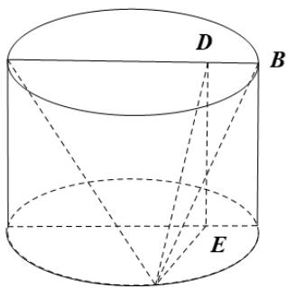

> [!faq]- 《专题11_基本立体图_柱体_椎体_台体_高效培优期中专项训练_数学人教》官方解析
>
> > [!success]- **【答案】** A. $VABC$ 的面积是定值 B. $VABC$ 的面积没有最大值 C. $VABC$ 的面积最大值是 $\sqrt{5}$ D. $VABC$ 的面积最大值是 $^{2}$
>
> > [!note]- **【解析】**
> > 
> > C
> >
> > 如图，过 C 作 CD 垂直于 AB，过 D 作 DE 垂直于底面，连接 CE，
> > 因为 AB 长为 $^{2}$ ，则 VABC 的面积为 $\frac{1}{2} \times AB \times CD = CD$ $CD = \sqrt{CE^{2} + DE^{2}} = \sqrt{CE^{2} + 4}$
> >
> > 因为 $CD$ 垂直于 $AB$ ， $DE$ 垂直于圆柱底面，所以 $DE$ 垂直于 $AB$ ，所以 $AB$ 垂直于平面 $CDE$ ，所以 $CE$ 垂直于 $AB$ ， $C$ 是底面圆周上动点，所以 $CE$ 最大等于底面半径，等于 1，所以 $CD$ 最大为 $\sqrt{5}$ ，即面积最大为 $\sqrt{5}$ 。
> >
> > 故选 **C**.
