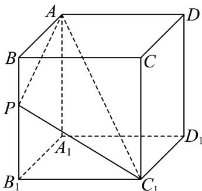
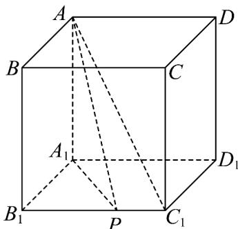

> [!faq]- 《专题11_基本立体图_柱体_椎体_台体_高效培优期中专项训练_数学人教》官方解析
>
> > [!success]- **【答案】** 6
>
> > [!note]- **【解析】**
> > 分两种情况分析 $P$ 点的存在情况：
> > - **①**：若点 P 在正方体中与 $AC_{1}$ 无公共点的棱上，
> >
> > 设 P 在正方体的棱 $BB_{1}$ 上，设 BP = x，则 $B_{1}P = 1 - x$ ，
> >
> > $\because PA + PC_{1} = 2, \therefore \sqrt{(1 - x)^{2} + 1} + \sqrt{x^{2} + 1} = 2$ ，即 $\sqrt{(1 - x)^{2} + 1} = 2 - \sqrt{x^{2} + 1}$
> >
> > 两边平方，整理得 $4\sqrt{x^2 + 1} = 3 + 2x$ ，再平方得 $12x^{2} - 12x + 7 = 0$ ，方程无解，
> >
> > 所以棱 $BB_{1}$ 上不存在满足条件的点P·
> >
> > 
> >
> > 同理，并结合正方体的对称性，知棱 $DD_{1}$ 、 $A_{1}B_{1}$ 、 $A_{1}D_{1}$ 、 $CD$ 、 $BC$ 上也不存在满足条件的点 $P$ ·
> > - **②**：若点 P 在正方体中与 $AC_{1}$ 有公共点的棱上，
> >
> > 设 P 在正方体的棱 $B_{1}C_{1}$ 上，设 $PC_{1}=x$ ，则 $B_{1}P=1-x$ ，
> >
> > $\because PA + PC_{1} = 2, \therefore \sqrt{(1 - x)^{2} + 1^{2} + 1^{2}} + x = 2$ ，即 $\sqrt{x^2 - 2x + 3} = 2 - x$
> >
> > 两边平方，整理得 $2x = 1$ ，解得 $x = \frac{1}{2}$ 所以棱 $B_{1}C_{1}$ 上存在一个满足条件的点 $P$
> >
> > 同理，并结合正方体的对称性，知棱 $C_{1}D_{1}$ 、 $CC_{1}$ 、AB、 $AA_{1}$ 、AD上也分别存在一个满足条件的点P；
> >
> > 
> >
> > 故满足条件的 P 点共有 6 个.
> >
> > 故答案为：6·
