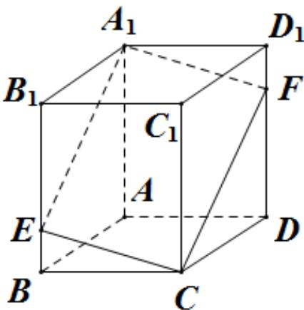

> [!faq]- 《专题11_基本立体图_柱体_椎体_台体_高效培优期中专项训练_数学人教》官方解析
>
> > [!success]- **【答案】** $12\sqrt{19}$
>
> > [!note]- **【解析】**
> > 由题意，正四棱柱 $ABCD - A_{1}B_{1}C_{1}D_{1}$ 中， $BE = \frac{1}{4} BB_{1} = 2$ ， $4AB = 3AA_{1}$ ，
> >
> > 可得 $AA_{1}=BB_{1}=CC_{1}=8,BE=2$
> >
> > 在 $DD_{1}$ 上取点 F ，使得 $D_{1}F = 2$ ，连接 $A_{1}F, CF$
> >
> > 则有 $A_{1}F = CE, A_{1}F // CE$
> >
> > 所以四边形 $A_{1}ECF$ 是平行四边形，
> >
> > 由勾股定理可得
> >
> > $$
> > A _ {1} E = \sqrt {6 ^ {2} + 6 ^ {2}} = 6 \sqrt {2}, C E = \sqrt {2 ^ {2} + 6 ^ {2}} = 2 \sqrt {1 0}, A _ {1} C = \sqrt {6 ^ {2} + 6 ^ {2} + 8 ^ {2}} = 2 \sqrt {3 4}
> > $$
> >
> > 所以 $\cos\angle A_{1}EC=\frac{A_{1}E^{2}+CE^{2}-A_{1}C^{2}}{2A_{1}E\times CE}=\frac{72+40-136}{2\times6\sqrt{2}\times2\sqrt{10}}=-\frac{\sqrt{5}}{10}$
> >
> > 所以 $\sin\angle A_{1}EC=\frac{\sqrt{95}}{10}$ ，
> >
> > 所以四边形 $A_{1}ECF$ 是平行四边形的面积为
> >
> > $$
> > A _ {1} E \times E C \times \sin \angle A _ {1} E C = 6 \sqrt {2} \times 2 \sqrt {1 0} \times \frac {\sqrt {9 5}}{1 0} = 1 2 \sqrt {1 9}
> > $$
> >
> > 故答案为： $12\sqrt{19}$
> >
> > 
> >
> > 考点 04 锥体展开图及最短距离问题
