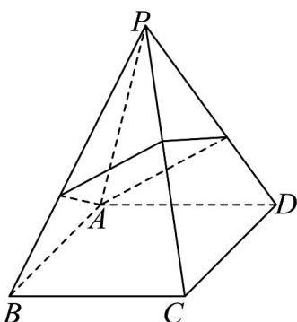
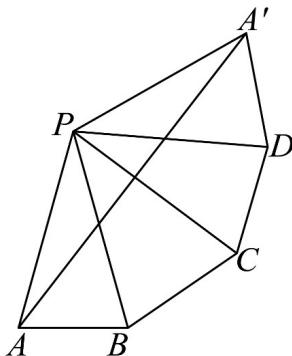

> [!faq]- 《专题11_基本立体图_柱体_椎体_台体_高效培优期中专项训练_数学人教》官方解析
>
> > [!success]- **【答案】**  A. $2\sqrt{2} + 2\sqrt{7}$ B. $2\sqrt{7} + 2$ C. $3\sqrt{7}$ D. $8\sqrt{2}$
>
> > [!note]- **【解析】**
> > 如图，将侧面 PAB，侧面 PBC，侧面 PCD，侧面 PDA 展开到一个平面内．
> > 由题意可知 $PA = PB = PC = PD = PA' = 4$ ， $AB = BC = CD = DA' = 2\sqrt{2}$ ，
> >
> > 设 $\angle APB = \angle BPC = \angle CPD = \angle DPA' = \theta$ ，则 $\cos \theta = \frac{16 + 16 - 8}{2\times 4\times 4} = \frac{3}{4}$
> >
> > 所以 $\cos 2\theta = 2\cos^2\theta -1 = \frac{1}{8}$ ，所以 $\cos 4\theta = 2\cos^2 2\theta -1 = -\frac{31}{32}$
> >
> > 由余弦定理可得 $A^{\prime}A^{2} = 4^{2} + 4^{2} - 2\times 4\times 4\times \left(-\frac{31}{32}\right) = 63$
> >
> > 则 $A^{\prime}A = 3\sqrt{7}$ ，即细绳的最短长度为 $3\sqrt{7}$
> >
> > 
> >
> > 故选 **C**.
