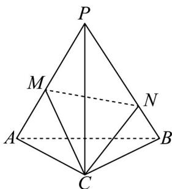
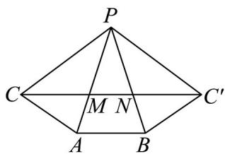

> [!faq]- 《专题11_基本立体图_柱体_椎体_台体_高效培优期中专项训练_数学人教》官方解析
>
> > [!success]- **【答案】**  A. $2\sqrt{6}$ B. $2\sqrt{5}$ C. $2\sqrt{3}$ D. $2\sqrt{2}$
>
> > [!note]- **【解析】**
> > 把正三棱锥沿 $PC$ 剪开并展开，形成三个全等的等腰三角形： $\triangle PBC'$ 、 $\triangle PAC$ 、 $\triangle PAB$ ，则 $\angle CPA = \angle BPC' = \angle APB = 40^\circ$ ， $\angle CPC' = 120^\circ$ ，
> >
> > 连接 $CC'$ ，交PB于N，交PA于M，
> >
> > 则线段 $CC'$ 就是 $\triangle CMN$ 的最小周长，又 $PC = PC' = 2\sqrt{2}$
> >
> > 根据余弦定理， $CC'=\sqrt{8+8-2\times2\sqrt{2}\times2\sqrt{2}\times\left(-\frac{1}{2}\right)}=2\sqrt{6}$
> >
> > 
> >
> > 故选 **A**.
