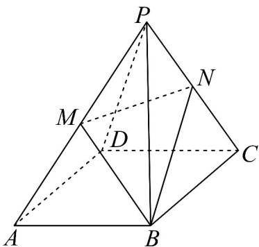
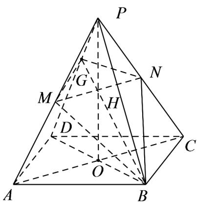
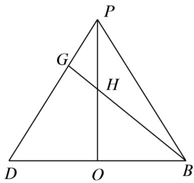

> [!faq]- 《专题11_基本立体图_柱体_椎体_台体_高效培优期中专项训练_数学人教》官方解析
>
> > [!success]- **【答案】**  A. 四边形 $MBNQ$ 是菱形 B. 四边形 $MBNQ$ 对角线 $MN$ 中点也是四棱锥 $P - ABCD$ 高线的中点 C. $\triangle MNQ \sim \triangle MNB$ D. $\angle MBN = 90^{\circ}$
>
> > [!note]- **【解析】**
> > 解：如图连接 $MN$ ， $AC$ 、 $BD$ ，设 $AC \cap BD = O$ ，连接 $OP$ ，设 $MN \cap OP = H$ ，因为 $M$ ， $N$ 为棱 $PA$ ， $PC$ 的中点，所以 $MN // AC$ ，则 $H$ 为 $OP$ 的中点，根据正四棱锥的性质可知 $PO$ 即为四棱锥 $P - ABCD$ 的高，故 ${}^{\mathrm{B}}$ 正确；
> >
> > 
> >
> > 延长 $_{BH}$ 交 $_{PD}$ 于点G，连接GM、GN，则 $\frac{DH}{2}\frac{DP}{DO}+\frac{1}{2}\frac{DO}{DO}=\frac{1}{2}\frac{DP}{DB}+\frac{1}{4}\frac{DB}{DB}$
> >
> > 因为 $G$ 、 $H$ 、 $B$ 三点共线，所以 $\frac{3}{4} \overline{DG} = \frac{1}{2} \overline{DP}$ ，即 $\overline{DP} = \frac{3}{2} \overline{DG}$ ，所以 $G$ 为 $PD$ 上靠近 $P$ 的三等分点，显然 $GM = GN$ ， $BM = BN$ 但是 $GM \neq BM$ ，故四边形 $MBNQ$ 不是菱形，且 $^{\triangle}MNQ$ 与 $\triangle MNB$ 不相似，故 $^{A}$ 、 $^{C}$ 错误；
> >
> > 因为正四棱锥的侧棱与底面边长关系无法得知，故 $\angle MBN$ 无法确定，故 $^{\mathrm{D}}$ 错误；
> >
> > 
> >
> > 故选 **B**
