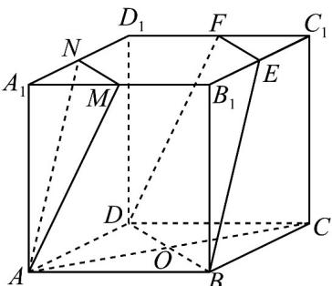
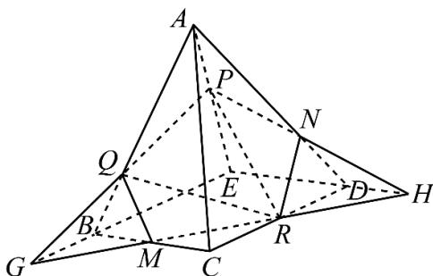

> [!faq]- 《专题11_基本立体图_柱体_椎体_台体_高效培优期中专项训练_数学人教》官方解析
>
> > [!success]- **【答案】** （1）作图见解析，周长为 $3\sqrt{2} + 2\sqrt{5}$ ；（2）作图见解析，边数为五。
>
> > [!note]- **【解析】**
> > (1)分别取 $E$ ， $F$ 为棱 $B_{1}C_{1}$ ， $C_1D_1$ 的中点，则由中位线性质得到： $EF\| B_1D_1\| MN\| BD$ ，所以四边
> >
> > 形 EFDB 为平面四边形，
> >
> > 又 $EN\| A_1B_1\| AB$ ， $EN = A_{1}B_{1} = AB$ ，所以四边形ENAB为平行四边形，所以 $EB\| AN$ ，由 $EF\| MN$ ， $EF\not\subset$ 平面AMN， $MN\subset$ 平面AMN，所以 $EFP$ 平面AMN，同理 $EB\|$ 平面AMN， $EF\cap EB = E$ ，由面面平行的判定定理可得平面 $AMN\parallel$ 平面EFDB，所以四边形EFDB即为所求截面，且为梯形，
> >
> > 由截面作法可知， $DB = 2\sqrt{2},EF = \frac{1}{2} DB = \sqrt{2},$ $EB = FD = \sqrt{1^2 + 2^2} = \sqrt{5}$ ，所以截面四边形 $EFDB$ 的周长为 $3\sqrt{2} +2\sqrt{5}$
> >
> > 
> >
> > (2) 延长 $PQ \cap EB$ 的延长线于 G，连接 $GR, GR \cap BC = M, GR \cap ED$ 的延长线于 H，连接 $PH, PH \cap AD$ 于 N，连接 QM, RN，则五边形 PQMRN 即为所求·所以截面多边形的边数为五·
> >
> > 
