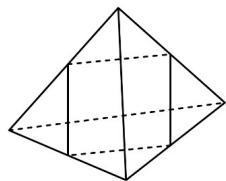
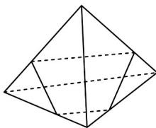
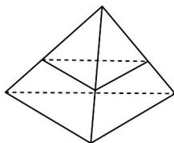

> [!faq]- 《专题11_基本立体图_柱体_椎体_台体_高效培优期中专项训练_数学人教》官方解析
>
> > [!success]- **【答案】** A. 1个 B. 2个 C. 3个 D. 4个
>
> > [!note]- **【解析】**
> > 解：根据已知，任意转动这个正四面体，则水面在容器中的形状即为作一截面将正四面体截成体积相等的两部分，根据对称性和截面性质作图如下：
> > 观察可知截面不可能出现直角三角形·
> >
> > 故选：C
> >
> > 
> >
> > 
> >
> > 
> >
> > 考点06棱锥及其相关计算
