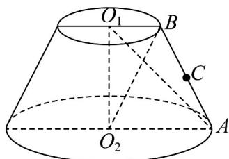
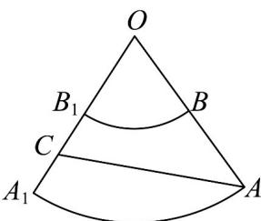

> [!faq]- 《专题11_基本立体图_柱体_椎体_台体_高效培优期中专项训练_数学人教》官方解析
>
> > [!success]- **【答案】** A
>
> > [!note]- **【解析】**
> > 因为圆 $O_{2}$ 的周长为 $2\pi$ ，则底面圆 $O_{2}$ 的半径 $R = AO_{2} = 1$ 又 $AO_{2} = 2BO_{1}$ ，所以上底面半径为 $r = BO_{1} = \frac{1}{2}$
> >
> > 
> >
> > 将圆台的侧面沿着母线 $AB$ 剪开，展成平面图形，延长 $AB$ 、 $A_{1}B_{1}$ 交于点 $O$ ，连接 $AC$ ，如图，
> >
> > 
> >
> > 显然弧 $AA_{1}$ 的长为 $2\pi$ ，弧 $BB_{1}$ 的长为 $\pi$ ，设 $\angle BOB_{1} = \alpha$ ，则 $\alpha \times OA = 2\pi$ ， $\alpha \times OB = \pi$ 则 $OA = 2OB$ ，又 $AB = 3$ ，即 $OA - OB = 3$ ，所以 $OA = 6$ ，则 $\alpha = \frac{\pi}{3}$ ， $OC = 3 + \frac{3}{2} = \frac{9}{2}$ ，在△AOC中由余弦定理 $AC = \sqrt{OA^2 + OC^2 - 2OA\cdot OC\cos\alpha}$ $= \sqrt{6^2 + \left(\frac{9}{2}\right)^2 - 2\times 6\times\frac{9}{2}\times\frac{1}{2}} = \frac{3\sqrt{13}}{2}$ 所以蚂蚁爬行的最短路程为 $\frac{3\sqrt{13}}{2}$
> >
> > 故选 **A**
