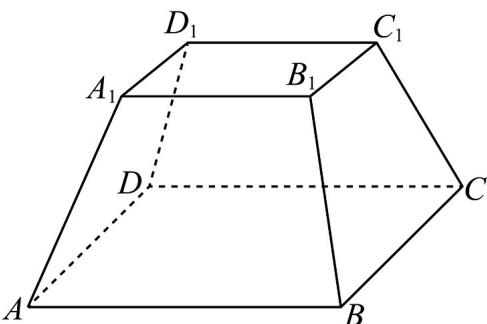
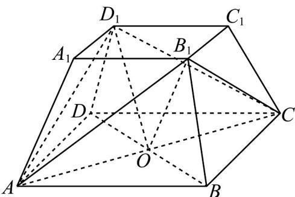

> [!faq]- 《专题11_基本立体图_柱体_椎体_台体_高效培优期中专项训练_数学人教》官方解析
>
> > [!success]- **【答案】**  A $AB = 4\sqrt{2}$ B $\angle B_{1}CA = 45^{\circ}$ C. 三棱锥 $B_{1} - CAD_{1}$ 外接球的半径为 $2\sqrt{3}$ D. 点 $D$ 到面 $AB_{1}C$ 的距离为 $2\sqrt{3}$
>
> > [!note]- **【解析】**
> > 连接 $AD_{1}, CD_{1}, AB_{1}, CB_{1}$ ，连接 $AC \cap BD = O$ ，连接 $B_{1}O, D_{1}O$ ，如下图所示：
> >
> > 
> >
> > 对于 A：因为几何体为正四棱台，所以 $AD_{1}=CD_{1}=4\sqrt{2}$ ，又 $AD_{1}\perp CD_{1}$ ，所以 $AC=\sqrt{AD_{1}^{2}+CD_{1}^{2}}=8$ ，
> > 又因为 $AC = \sqrt{2} AB$ ，所以 $AB = 4\sqrt{2}$ ，故正确；
> >
> > 对于 B：因为几何体为正四棱台，所以 $AB_{1}=CB_{1}=AD_{1}=4\sqrt{2}$ ，所以 $AB_{1}^{2}+CB_{1}^{2}=AC^{2}$
> >
> > 所以 $\triangle B_{1}CA$ 为等腰直角三角形，所以 $\angle B_{1}CA = 45^{\circ}$ ，故正确；
> >
> > 对于 $C$ ：由上可知 $\triangle B_{1}CA$ ， $\triangle D_{1}CA$ 均为等腰直角三角形，所以 $AO = CO = B_{1}O = D_{1}O = \frac{1}{2} AC = 4$
> >
> > 所以三棱锥 $B_{1}-CAD_{1}$ 的外接球的球心为 O，且半径等于 4，故错误；
> >
> > 对于 D：设点 D 到面 $AB_{1}C$ 的距离为 h，又 $V_{D-AB_{1}C}=V_{B_{1}-ADC}$
> >
> > 所以 $\frac{1}{3}\cdot h\cdot S_{\triangle AB_{1}C}=\frac{1}{3}\times2\sqrt{3}\times S_{\triangle ADC}$ ，且 $S_{\triangle AB_{1}C}=\frac{4\sqrt{2}\times4\sqrt{2}}{2}=16, S_{\triangle ADC}=\frac{4\sqrt{2}\times4\sqrt{2}}{2}=16$ ，所以 $h=2\sqrt{3}$ ，故正确，故选：ABD.
> >
> > 47．棱锥的高为 16，底面积为 512，平行于底面的截面面积为 50，则截得的棱台的高为 \_\_\_\_。
> >
> > 【答案】11
> >
> > 【详解】设棱台的高为 x，则有 $\left(\frac{16-x}{16}\right)^{2}=\frac{50}{512}$ ，解之，得 x=11.
> >
> > 故答案为 $^{11}$
