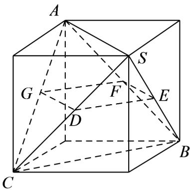

> [!faq]- 《专题11_基本立体图_柱体_椎体_台体_高效培优期中专项训练_数学人教》官方解析
>
> > [!success]- **【答案】** A. 长方体 B. 圆台 C. 四棱台 D. 正四面体
>
> > [!note]- **【解析】**
> > 解：对于 $A$ ：若长方体的底面为正方形，则用平行于底面的平面去截几何体，所得截面的形状是正方形，故 $A$ 正确；
> >
> > 对于 $^{B}$ ：圆台的截面均不可能是正方形，故 $^{B}$ 错误；
> >
> > 对于 $C$ ：若四棱台的底面是正方形，则用平行于底面的平面去截几何体，所得截面的形状是正方形，故 $C$
> >
> > 正确；
> >
> > 对于 D：如图所示正四面体 S-ABC，将其放到正方体中，
> >
> > 
> >
> > 取 $SB$ 的中点 $E$ ， $SC$ 的中点 $D$ ，取 $AB$ 的中点 $F$ ， $AC$ 的中点 $DG$ ，
> >
> > 依次连接 EF 、 FG 、 GD 、 DE ，由正方体的性质可知截面 DEFG 为正方形，故 D 正确；
> >
> > 故选 **ACD**
