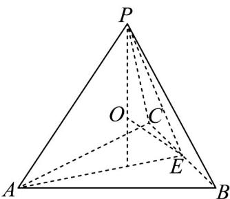

> [!faq]- 《专题12_基本立体图_球_简单几何体_高效培优期中专项训练_数学人教A》官方解析
>
> > [!success]- **【答案】** A. 1 B. $\sqrt{3}$ C. $\sqrt{5}$ D. $\sqrt{6}$
>
> > [!note]- **【解析】**
> > 如下图示， $OP = 3$ ，令正四面体的棱长为 $a$ ，则底面半径 $r = \frac{2}{3} \times \frac{\sqrt{3}}{2} a = \frac{\sqrt{3}}{3} a$
> >
> > 所以 $OP = \sqrt{\left(\frac{\sqrt{3}}{2}a\right)^2 - \left(\frac{1}{3}\times\frac{\sqrt{3}}{2}a\right)^2} -\sqrt{9 - \left(\frac{\sqrt{3}}{3}a\right)^2} = 3$
> >
> > 所以 $\sqrt{\frac{2}{3}a^2} -\sqrt{9 - \frac{1}{3}a^2} = 3$ ，则 $\frac{2}{3} a^2 = 9 + 6\sqrt{9 - \frac{1}{3}a^2} +9 - \frac{1}{3} a^2$
> >
> > 所以 $a^2 - 18 = 6\sqrt{9 - \frac{1}{3}a^2}$ ，则 $a^4 - 36a^2 + 324 = 324 - 12a^2$ ，可得 $a^2 = 24$ ，
> >
> > 要使截面圆半径最小，只需 $OE$ 垂直于截面圆，而 $OE = \sqrt{9 - \frac{1}{3}a^2 + (\frac{\sqrt{3}}{6}a)^2} = \sqrt{9 - \frac{1}{4}a^2} = \sqrt{3}$ 所以截面圆半径为 $\sqrt{9 - OE^2} = \sqrt{6}$ .
> >
> > 
> >
> > 故选 **D**
