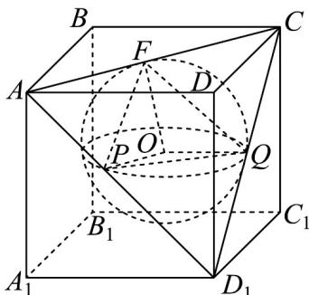

> [!faq]- 《专题12_基本立体图_球_简单几何体_高效培优期中专项训练_数学人教A》官方解析
>
> > [!success]- **【答案】** A. $2\pi$ B. $\frac{8\pi}{3}$ C. $3\pi$ D. $4\pi$
>
> > [!note]- **【解析】**
> > 如图，正方体 $ABCD - A_{1}B_{1}C_{1}D_{1}$ 中，
> >
> > 直线 $AD_{1}, AC, D_{1}C$ 与正方体的内切球分别切于 $P, F, Q$
> >
> > 且 $P, F, Q$ 分别是 $AD_{1}, AC, D_{1}C$ 的中点.
> >
> > 正方体内切球为 O，连接 OP、OQ、OF。
> >
> > 则 $OP, OQ, OF$ 互相垂直，且 $OP = OQ = OF = 2$ ，所以 $FP = FQ = PQ = 2\sqrt{2}$
> >
> > 则过 $A, C, D_{1}$ 三点的截面为球内过这三点的截面圆，
> >
> > 截面圆的半径为 $R=\frac{PF}{2\sin60^{\circ}}=\frac{2\sqrt{2}}{\sqrt{3}}=\frac{2\sqrt{6}}{3}$ ，其面积为 $\pi\times\left(\frac{2\sqrt{6}}{3}\right)^{2}=\frac{8\pi}{3}$ .
> >
> > 故选：B.
> >
> > 
