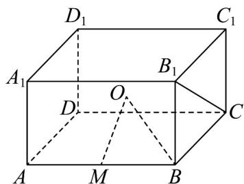

> [!faq]- 《专题12_基本立体图_球_简单几何体_高效培优期中专项训练_数学人教A》官方解析
>
> > [!success]- **【答案】** ②
>
> > [!note]- **【解析】**
> > 解：①如图，球 $^{O}$ 为正四棱柱体对角线的中点，设球的半径为R，则
> >
> > $$
> > 2 R = \sqrt {(2 \sqrt {7}) ^ {2} + (2 \sqrt {7}) ^ {2} + (2 \sqrt {2}) ^ {2}} = 8, R = 4
> > $$
> >
> > 由于 $OM \perp AB$ ，所以 $OM = \sqrt{R^{2} - BM^{2}} = \sqrt{16 - 7} = 3$ ，
> >
> > 所以 $PM$ 长的最大值为 $7$ ，所以①错误；
> > - **②**：当过点 $M$ 的平面与 $OM$ 垂直时，截面面积最小，此时截面为小圆，且圆的半径为 $\sqrt{7}$ ，其面积 $7\pi$ ，所以 ②正确；
> > - **③**：由②点 $M$ 的平面截球 $O$ 所得截面面积最小时，截面与 $OM$ 垂直，与 $BC$ 相交，所以截面与 $B_{1}C_{1}$ 不平行，所以③错误；
> > - **④**：过点 $M$ 的平面截球 $O$ 所得截面面积最大时，过点 $M$ 和球 $O$ ，也过点 $B$ ， $C_1$ ，而四边形 $BCC_1B_1$ 为矩形，且 $BC \neq BB_1$ ，所以 $BC_1$ 与 $B_1C$ 不垂直，所以 $B_1C$ 不可能垂直该截面，所以④错误，
> >
> > 故答案为：②
> >
> > 
> > 考点 04 组合体的构成
