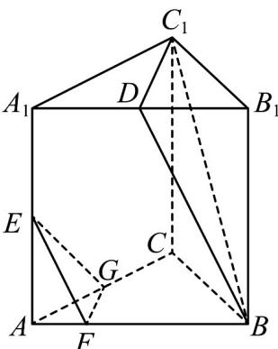
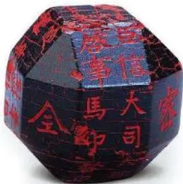
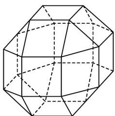
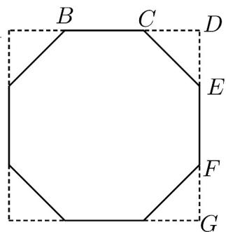

> [!faq]- 《专题12_基本立体图_球_简单几何体_高效培优期中专项训练_数学人教A》官方解析
>
> > [!success]- **【答案】**  A. $\Omega$ 有7个面 B. $\Omega$ 有13条棱 C. $\Omega$ 有7个顶点 D. 平面 $BC_{1}D\cap$ 平面 $ABB_{1}A_{1} = BD$
>
> > [!note]- **【解析】**
> > 由图可知，Ω有面BCGF、面EFG、面 $BDC_{1}$ 、面 $BCC_{1}$ 、面 $BFEA_{1}D$ 、面 $GEA_{1}C_{1}C$ 、面 $A_{1}C_{1}D$ 共7个，Ω有顶点B、C、G、F、E、 $A_{1}$ 、 $C_{1}$ 、D共8个，
> > Ω有棱BF、FG、GC、CB、FE、EG、BD、 $DC_{1}$ 、 $BC_{1}$ 、 $CC_{1}$ 、 $DA_{1}$ 、 $C_{1}A_{1}$ 、 $EA_{1}$ ，共13条，
> > 平面 $BC_{1}D\cap$ 平面 $ABB_{1}A_{1}=BD$ ·故正确的选项有ABD.
> >
> > 故选：ABD
> >
> > 21. 中国有悠久的金石文化，印信是金石文化的代表之一·印信的形状多为长方体、正方体或圆柱体，但南北朝时期的官员独孤信的印信形状是“半正多面体”（图 $^{1}$ ）·半正多面体是由两种或两种以上的正多边形围成的多面体·半正多面体体现了数学的对称美·图 $^{2}$ 是一个棱数为 $^{48}$ 的半正多面体，它的所有顶点都在同一个正方体的表面上，且此正方体的棱长为 $^{1}$ ，则该半正多面体共有面的个数及棱长分别为（）
> >
> > 【答案】
> >
> > 
> > 图1
> >
> > 
> > 图2
> >
> > A. 26, $\sqrt{2} - 1$ B. 24, $2 - \sqrt{2}$ C. 26, $2 - \sqrt{2}$ D. 24, $\sqrt{2} - 1$
> >
> > 【答案】A
> >
> > 【详解】可以将该多面体分为三层，上层8个面，中层8个面，下层8个面，上下底各1个面，
> > 所以共有 $8+8+8+1+1=26$ 个面，
> > 设正多面体的棱长为a，作出该几何体的截面如图，截面图为正八边形，
> > 由图可得 $CD=\frac{1-a}{2}$ ，CE=a，
> > 因为 $\triangle CDE$ 为等腰直角三角形，所以 $CE=\sqrt{2}CD$ ，即 $a=\sqrt{2}\times\frac{1-a}{2}$ ，
> > 解得： $a=\frac{1}{\sqrt{2}+1}=\sqrt{2}-1$ ，所以该多面体的棱长为 $\sqrt{2}-1$ ，
> >
> > 故选：A.
> >
> > 
