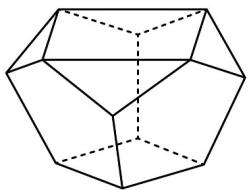

> [!faq]- 《专题12_基本立体图_球_简单几何体_高效培优期中专项训练_数学人教A》官方解析
>
> > [!success]- **【答案】** ②（或③或④）①③⑤（或②③④）
>
> > [!note]- **【解析】**
> > （ $^{1}$ ）由已知条件可知，①～⑤中选出一个模块可以是②，也可以是③，也可以是④。
> >
> > (2) 以②③④为例，中间层用③补齐，最上层用②④，
> >
> > 还可以是①③⑤，中间层用③补齐，最上层用①⑤，
> >
> > 故答案为：②（或③或④），①③⑤（或②③④）.
> >
> > 23. 图中的十面体的面是由四个正五边形，四个三角形和两个正方形组成的，则图中上正方形面积是下正方形面积的（）倍·
> >
> > 
> >
> > A 1 B 2 C 3 D 4
> >
> > 【答案】B
> >
> > 【详解】观察两个相邻的正五边形，它们的组成的图形是对称的，
> > 由于它们的一侧可以夹一个正方形，
> > 所以另一侧也可以加一个正方形，
> > 因此，图中的三角形为等腰直角三角形，
> > 不妨设正五边形的边长为1，
> > 则等腰直角三角形的斜边为 $\sqrt{2}$ ，
> > 所以下底面正方形的边长为 $^{1}$ ，上底面正方形的边长为 $\sqrt{2}$ ，
> > 所以上底面正方形的面积为 $^{2}$ ，下底面正方形的面积为 $^{1}$ ，
> > 所以上正方形面积是下正方形面积的 $^{2}$ 倍，
> >
> > 故选 **B**
