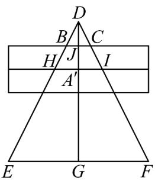

> [!faq]- 《专题12_基本立体图_球_简单几何体_高效培优期中专项训练_数学人教A》官方解析
>
> > [!success]- **【答案】** C
>
> > [!note]- **【解析】**
> > 过点 B，C 作垂直于正四棱锥底面的截面，如图所示，
> >
> > 
> >
> > 由题意可得 $DE = 3\sqrt{10}$
> >
> > 因为正四棱锥的底面边长为 $6$ ，所以 $EF = 6\sqrt{2}$ ， $DG = \sqrt{DE^2 - EG^2} = 6\sqrt{2}$
> >
> > $HI$ 的长度为正四棱柱底面正方形对角线的长度，即 $HI = 4$ ， $JA^{\prime} = 2$
> >
> > 因为 $\frac{HA'}{EG} = \frac{DA'}{DG}$ ，所以 $DA' = 4, DJ = 2$ ，
> >
> > 因为 $\frac{BJ}{HA'} = \frac{DJ}{DA'}$ ，所以 BJ = 1，BC = 2。
> >
> > 故选 **C**
