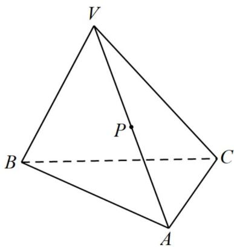
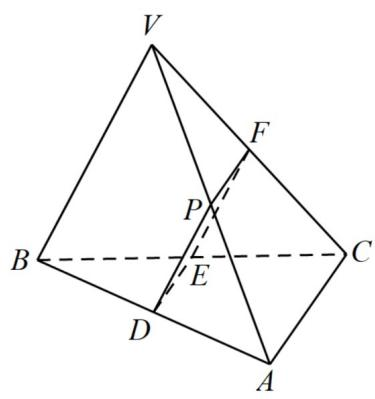

> [!faq]- 《专题12_基本立体图_球_简单几何体_高效培优期中专项训练_数学人教A》官方解析
>
> > [!success]- **【答案】**  A.12 B.10 C.8 D.6
>
> > [!note]- **【解析】**
> > 如图所示，设 AB、BC、VC 的中点分别为 D,E,F，连接 PD,DE,EF,PF.
> > 由题得 PD||VB,DE||AC,
> > 因为 $PD,DE \subseteq$ 平面 DEFP,VB,AC 不在平面 DEFP 内，
> > 所以 VB||平面 DEFP,AC||平面 DEFP,
> > 所以截面 DEFP 就是所作的平面
> > 由于 $PD \parallel VB, EF \parallel VB, PD = \frac{1}{2}VB, EF == \frac{1}{2}VB$ ,
> > 所以四边形 DEFP 是平行四边形，
> > 因为 VB=4,AC=2,所以 PD=FE=2,DE=PF=1,
> > 所以截面 DEFP 的周长为 $2+2+1+1=6$ .
> > 故选：D
> >
> > 
> > 考点07组合体的切接问题
