> [!faq]- 《专题12_基本立体图_球_简单几何体_高效培优期中专项训练_数学人教A》官方解析
>
> > [!success]- **【答案】** 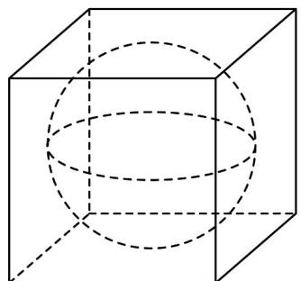 A. 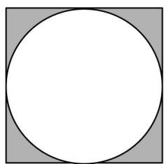 B 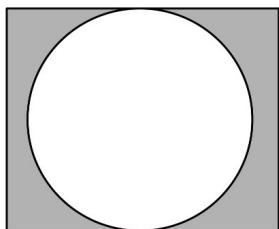 C 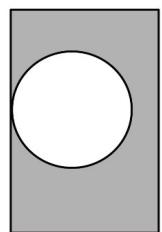 D 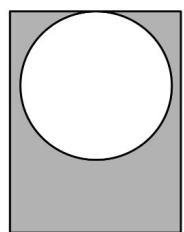
>
> > [!note]- **【解析】**
> > 对于 $A$ ，用竖直的平面截正方体，该平面过球心，且过正方体四个面的中心，即可得到截面图形 $A$ ，如图；
> >
> > 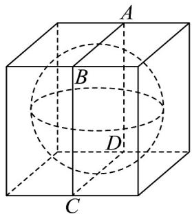
> >
> > 对于 $^{B}$ ，用竖直的平面截正方体，该平面为正方体的对角面过球心，及正方体两个侧面的对角线的中心，即可得到截面图形 $^{B}$ ；
> >
> > 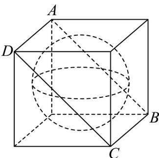
> >
> > 对于 $CD$ ，用竖直的平面截正方体，该平面过正方体一个侧面的中心，如图，切点在截面 $ABCD$ 的边 $CD$ 的中点处，且 $CD$ 为长方形 $ABCD$ 中较短的线段，即可得到 $D$ .
> >
> > 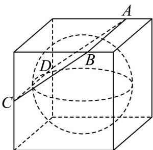
> >
> > 故选：C
> >
> > 38. 正方体 $ABCD - A_{1}B_{1}C_{1}D_{1}$ 的棱长为 2， $AB, A_{1}D_{1}$ 的中点分别是 $P, Q$ ，直线 $PQ$ 与正方体的外接球 $O$ 相交于 $M, N$ 两点点 $G$ 是球 $O$ 上的动点则 $\triangle GMN$ 面积的最大值为（）A. $\frac{\sqrt{5} + \sqrt{30}}{2}$ B. $\frac{2\sqrt{2} + \sqrt{3}}{2}$ C. $\frac{3\sqrt{2} + \sqrt{6}}{2}$ D. $\frac{\sqrt{62}}{4}$
> >
> > 【答案】A
> >
> > 【详解】如图，设正方体外接球球 O 的半径为 r，过球心 O 作 $OH \perp PQ$ ，垂足为 H，易知 H 为 PQ 的中点。
> >
> > 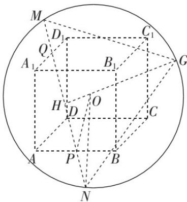
> >
> > 因为正方体 $ABCD - A_{1}B_{1}C_{1}D_{1}$ 的棱长为 2，
> >
> > 所以 $PQ = \sqrt{6}, HP = \frac{\sqrt{6}}{2}, OP = \sqrt{2}, ON = r = \sqrt{3}$
> >
> > 所以 $OH = \sqrt{OP^2 - HP^2} = \sqrt{2 - \frac{6}{4}} = \frac{\sqrt{2}}{2}$
> >
> > $HN = \sqrt{ON^2 - OH^2} = \sqrt{3 - \frac{2}{4}} = \frac{\sqrt{10}}{2}$ 所以 $MN = \sqrt{10}$
> >
> > 因为点 $G$ 是球 $O$ 上的动点，
> >
> > 所以点 $G$ 到 $MN$ 的最大距离为 $h = OH + r = \frac{\sqrt{2}}{2} +\sqrt{3}$
> >
> > 故 $\triangle GMN$ 面积的最大值为 $\frac{1}{2} MN\cdot h = \frac{1}{2}\times \sqrt{10}\times \left(\frac{\sqrt{2}}{2} +\sqrt{3}\right) = \frac{\sqrt{5} + \sqrt{30}}{2}$
> >
> > 故选：A
> >
> > 39. 棱长为 $^{1}$ 的正四面体 ABCD 内有一个内切球 O, M 为 CD 中点，N 为 BM 中点，连接 AN 交球 O 于 P, Q 两点，则 PQ 的长为（） A. $\frac{2\sqrt{33}}{33}$ B. $\frac{3\sqrt{11}}{11}$ C. $\frac{\sqrt{22}}{24}$ D. $\frac{\sqrt{3}}{10}$
> >
> > 【答案】A
> >
> > 【详解】如左图，设 $\triangle BCD$ 的中心为E，则 $AE\perp$ 平面BCD.
> >
> > 因为正四面体 ABCD 的棱长为 1，
> >
> > 所以 $BM = \frac{\sqrt{3}}{2}$ ， $BE = \frac{2}{3} BM = \frac{\sqrt{3}}{3}$ ， $AE = \sqrt{AB^2 - BE^2} = \frac{\sqrt{6}}{3}$ 故正四面体 $ABCD$ 的体积 $V = \frac{1}{3} \times \frac{\sqrt{3}}{4} \times 1^2 \times \frac{\sqrt{6}}{3} = \frac{\sqrt{2}}{12}$ ，
> > 正四面体 $ABCD$ 的表面积 $S = \frac{\sqrt{3}}{4} \times 1^2 \times 4 = \sqrt{3}$ ，
> > 设正四面体 $ABCD$ 的内切球半径为 $r$ ，则由 $V = \frac{S}{3} r$ 得 $r = \frac{3V}{S} = \frac{\sqrt{6}}{12}$ .
> > 因为 $N$ 是 $BM$ 的中点，所以 $EN = \frac{1}{6} BM = \frac{\sqrt{3}}{12}$ ， $AN = \sqrt{AE^2 + EN^2} = \frac{\sqrt{11}}{4}$ .
> > 考察正四面体 $ABCD$ 过 $A, B, M$ 三点的截面图（如右图），
> > 则 $OA = AE - OE = AE - r = \frac{\sqrt{6}}{3} - \frac{\sqrt{6}}{12} = \frac{\sqrt{6}}{4}$ ，
> > 过点 $O$ 向 $AN$ 作垂线 $OG$ ，垂足为 $G$ ，则 $\triangle OAG \sim \triangle NAE$ ，
> > 所以 $\frac{OA}{AN} = \frac{OG}{EN}$ ，因此 $OG = \frac{OA \cdot EN}{AN} = \frac{\sqrt{2}}{4\sqrt{11}}$ ，
> > 故 $PQ = 2\sqrt{r^2 - OG^2} = 2\sqrt{\frac{1}{24} - \frac{1}{88}} = 2\sqrt{\frac{1}{33}} = \frac{2\sqrt{33}}{33}$
> >
> > 故选：A.
> >
> > 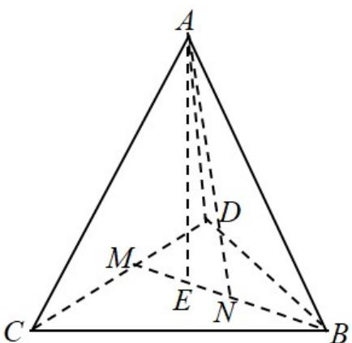
> >
> > 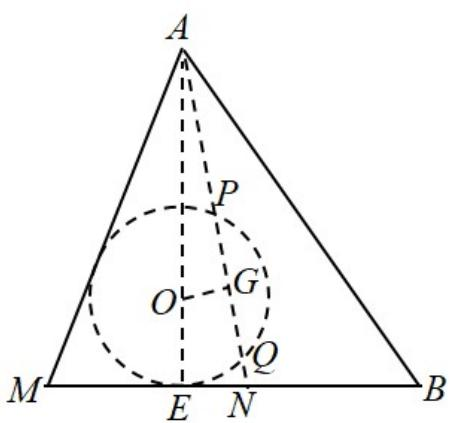
