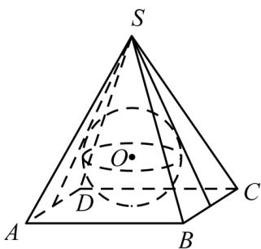
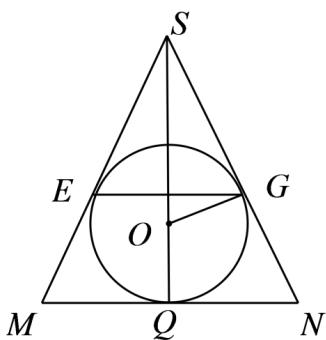

> [!faq]- 《专题12_基本立体图_球_简单几何体_高效培优期中专项训练_数学人教A》官方解析
>
> > [!success]- **【答案】**  A. $\frac{1}{2}$ B. 1 C. $\frac{3}{2}$ D. 2
>
> > [!note]- **【解析】**
> > 如图，作出过正四棱锥顶点和底面对边中点的截面 $\triangle SMN$ ，不妨设 $M,N$ 是 $AD,BC$ 中点（ $SM,SN$ 是正四棱锥的斜高），则 $\triangle SMN$ 的内切圆是正四棱锥内切球的大圆，切点 $E,G$ 为球与正四棱锥侧面的切点，
> >
> > 正四棱锥 S-ABCD 中， $AB=6$ ， $SA=3\sqrt{5}$ ，则 $SM=SN=\sqrt{(3\sqrt{5})^{2}-3^{2}}=6$ ，MN=AB=6， $\triangle SMN$ 是等边三角形，则 E,G 分别为 SM,SN 的中点， $EG=\frac{1}{2}MN=3$ ，
> > 由正四棱锥性质知四边形 EFGH 是正方形，所以外接圆半径为 $r=\frac{1}{2}EG=\frac{3}{2}$ .
> >
> > 故选：C.
> >
> > 
