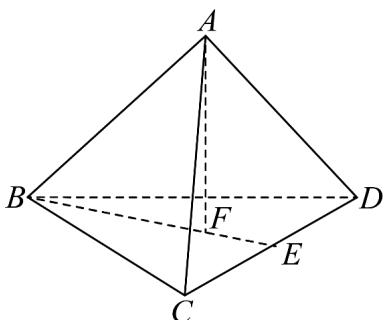
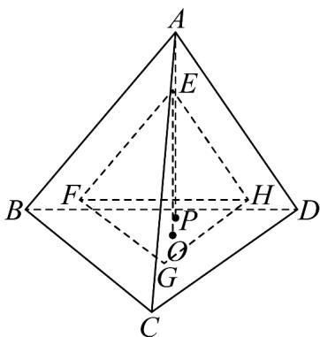

## 考点 03 直线与球、平面与球的位置关系

13. 直观想象是数学六大核心素养之一，某位教师为了培养学生的直观想象能力，在课堂上提出了这样一个问题：现有 $^{10}$ 个直径为 $^{4}$ 的小球，全部放进棱长为a的正四面体盒子中，则a的最小值为（）

【答案】

A. $6 + 4\sqrt{6}$ B. $8 + 4\sqrt{6}$ C. $4 + 4\sqrt{6}$ D. $5 + 4\sqrt{6}$

【答案】B

【详解】我们先来证明如下引理：

如下图所示：

设正四面体棱长为 $a$ ， $AF \perp$ 面 $BCD$ ， $BE \perp CD$

所以 $CE = \frac{1}{2} CD = \frac{a}{2}$ ， $BE = \sqrt{BC^2 - CE^2} = \sqrt{a^2 - \left(\frac{a}{2}\right)^2} = \frac{\sqrt{3} a}{2}$

显然 $F$ 为面 $BCD$ 的重心，所以 $BF = \frac{2}{3} BE = \frac{\sqrt{3}a}{3}$ ，由勾股定理可得面

$$
A F = \sqrt {A B ^ {2} - B F ^ {2}} = \sqrt {a ^ {2} - \left(\frac {\sqrt {3} a}{3}\right) ^ {2}} = \frac {\sqrt {6} a}{3},
$$

所以正四面体的高等于其棱长的 $\frac{\sqrt{6}}{3}$ 倍

接下来我们来解决此题：

如下图所示：

$^{10}$ 个直径为 $^{4}$ 的小球放进棱长为a的正四面体ABCD中，成三棱锥形状，有 $^{3}$ 层，则从上到下每层的小球个数依次为： $^{1}$ ， $(1+2)$ ， $(1+2+3)$ 个，

当 $a$ 取最小值时，从上到下每层放在边缘的小球都与正四面体的侧面相切，底层的每个球都与正四面体底面相切，

任意相邻的两个小球都外切，位于每层正三角状顶点的所有上下相邻小球的球心连线为一个正四面体 $E - FGH$

则该正四面体 $EFGH$ 的棱长为 $2 + 4 + 2 = 8$ ，可求得其高为 $EP = 8 \times \frac{\sqrt{6}}{3} = \frac{8\sqrt{6}}{3}$

所以正四面体 ABCD 的高为 $AQ = AE + EP + PQ = 2 \times 3 + \frac{8\sqrt{6}}{3} + 2 = 8 + \frac{8\sqrt{6}}{3}$

进而可求得其棱长 $a$ 的最小值为 $\left(8 + \frac{8\sqrt{6}}{3}\right)\times \frac{3}{\sqrt{6}} = 8 + 4\sqrt{6}$

故选：B.

![[高中/课堂同步/题库/人教A版高中数学同步讲义(2026)/02_必修第二册/期中专项训练+期中模拟卷/专项训练/专题12_基本立体图_球_简单几何体_高效培优期中专项训练_数学人教A/_compact/Q00064055.md]]
![[高中/课堂同步/题库/人教A版高中数学同步讲义(2026)/02_必修第二册/期中专项训练+期中模拟卷/专项训练/专题12_基本立体图_球_简单几何体_高效培优期中专项训练_数学人教A/_compact/Q00064056.md]]
![[高中/课堂同步/题库/人教A版高中数学同步讲义(2026)/02_必修第二册/期中专项训练+期中模拟卷/专项训练/专题12_基本立体图_球_简单几何体_高效培优期中专项训练_数学人教A/_compact/Q00064057.md]]
![[高中/课堂同步/题库/人教A版高中数学同步讲义(2026)/02_必修第二册/期中专项训练+期中模拟卷/专项训练/专题12_基本立体图_球_简单几何体_高效培优期中专项训练_数学人教A/_compact/Q00064058.md]]
![[高中/课堂同步/题库/人教A版高中数学同步讲义(2026)/02_必修第二册/期中专项训练+期中模拟卷/专项训练/专题12_基本立体图_球_简单几何体_高效培优期中专项训练_数学人教A/_compact/Q00064059.md]]
![[高中/课堂同步/题库/人教A版高中数学同步讲义(2026)/02_必修第二册/期中专项训练+期中模拟卷/专项训练/专题12_基本立体图_球_简单几何体_高效培优期中专项训练_数学人教A/_compact/Q00064060.md]]
![[高中/课堂同步/题库/人教A版高中数学同步讲义(2026)/02_必修第二册/期中专项训练+期中模拟卷/专项训练/专题12_基本立体图_球_简单几何体_高效培优期中专项训练_数学人教A/_compact/Q00064061.md]]
![[高中/课堂同步/题库/人教A版高中数学同步讲义(2026)/02_必修第二册/期中专项训练+期中模拟卷/专项训练/专题12_基本立体图_球_简单几何体_高效培优期中专项训练_数学人教A/_compact/Q00064062.md]]
