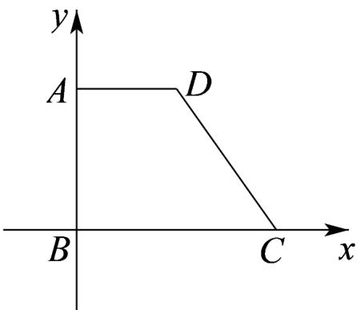

<!-- question-source:start -->
27. 如图，在平面直角坐标系中，四边形 $ABCD$ 是直角梯形， $\angle ABC = 90^{\circ}$ ， $AD \parallel BC, BC = 2AD = 2AB = \sqrt{2}$ ，若四边形 $ABCD$ 的斜二测直观图为 $A'B'C'D'$ ， $x', y'$ 轴的夹角为 $45^{\circ}$ ，则直观图中四边形

$A^{\prime}B^{\prime}C^{\prime}D^{\prime}$ 的周长为（）

A. $3 + \sqrt{2} +\sqrt{3}$ B. $2 + \sqrt{2} +\sqrt{3}$ C. $3 + \sqrt{2}$ D. $3 + \sqrt{3}$
<!-- question-source:end -->

![[高中/课堂同步/题库/人教A版高中数学同步讲义(2026)/02_必修第二册/期中专项训练+期中模拟卷/专项训练/专题13_立体图形的直观图_高效培优期中专项训练_数学人教A版高一必修/_compact/answers/Q00064102A1.md]]
