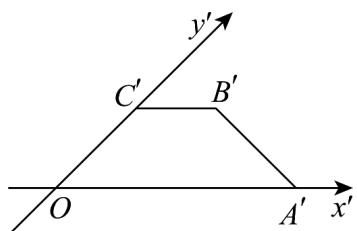
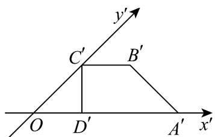
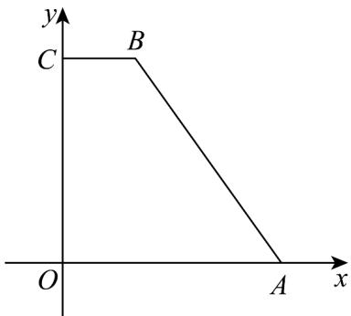
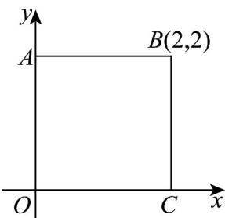

> [!faq]- 《专题13_立体图形的直观图_高效培优期中专项训练_数学人教A版高一必修》官方解析
>
> > [!success]- **【答案】**  A. 2 B. $\sqrt{2}$ C. 4 D. $2\sqrt{2}$
>
> > [!note]- **【解析】**
> > 过 $C^{\prime}$ 作 $C^{\prime}D^{\prime}\perp A^{\prime}O$ ，垂足为 $D^{\phi}$ ，如下图：
> >
> > 
> >
> > 由题意可得 $\frac{1}{2}\left(\left|A'O\right|+\left|B'C'\right|\right)\cdot\left|C'D'\right|=\sqrt{2}$ ， $\left|OC'\right|=\sqrt{2}\left|C'D'\right|$ ，
> >
> > 由斜二测画法，还原可得下图：
> >
> > 
> >
> > 易知 $\left|A^{\prime}O\right|=\left|AO\right|$ ， $\left|B^{\prime}C^{\prime}\right|=\left|BC\right|$ ， $\left|OC\right|=2\left|OC^{\prime}\right|=2\sqrt{2}\left|C^{\prime}D^{\prime}\right|$
> >
> > 所以原梯形面积为 $\frac{1}{2}\left(|AO| + |BC|\right) \cdot |OC| = \frac{1}{2}\left(|A'O| + |B'C'|\right) \cdot 2\sqrt{2}|C'D'| = 4.$
> >
> > 故选：C.
> >
> > 
