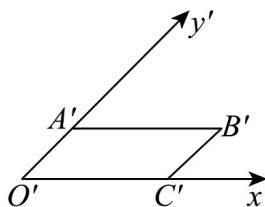

> [!faq]- 《专题13_立体图形的直观图_高效培优期中专项训练_数学人教A版高一必修》官方解析
>
> > [!success]- **【答案】** B
>
> > [!note]- **【解析】**
> > 斜二测画法：原图中平行于 $x$ 轴的线段，直观图中平行于 $x'$ 轴且长度不变；原图中平行于 $y'$ 轴的线段，直观图中平行于 $y'$ 轴且长度减半，如图所示，
> >
> > 
> >
> > ，顶点到轴的距离为 $1\times \sin 45^{\circ} = \frac{\sqrt{2}}{2}$
> >
> > 故选 **B**
