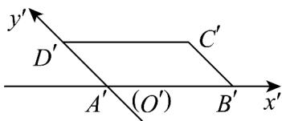

> [!faq]- 《专题13_立体图形的直观图_高效培优期中专项训练_数学人教A版高一必修》官方解析
>
> > [!success]- **【答案】** 
>
> > [!note]- **【解析】**
> > 设正方形 ABCD 的边长为 a，则正方形 ABCD 的周长为 4a
> >
> > 直观图 $A'B'C'D'$ 中， $A'B' = a, A'D' = \frac{1}{2}a$ ，则其周长为 $2a + 2 \times \frac{1}{2}a = 3a$
> >
> > 所以正方形 ABCD 与直观图 $A^{\prime}B^{\prime}C^{\prime}D^{\prime}$ 的周长之比为 4:3.
> >
> > 故答案为：4:3.
