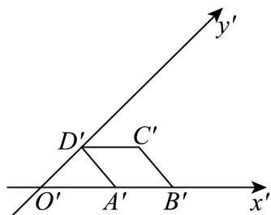
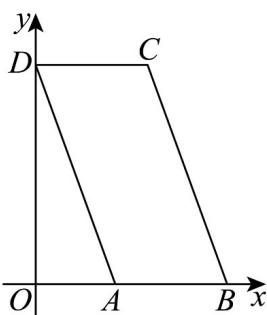

> [!faq]- 《专题13_立体图形的直观图_高效培优期中专项训练_数学人教A版高一必修》官方解析
>
> > [!success]- **【答案】** 
>
> > [!note]- **【解析】**
> > 由题可知 $O^{\prime}D^{\prime} = A^{\prime}D^{\prime} = 2, \angle A^{\prime}O^{\prime}D^{\prime} = 45^{\circ}$
> >
> > $\therefore O^{\prime}A^{\prime} = 2\sqrt{2}$ ，还原直观图可得原平面图形，如图，
> >
> > 
> >
> > 则 $OD = 2O'D' = 4, OA = O'A' = 2\sqrt{2}, AB = DC = 2$
> >
> > ∴原平面图形的面积为 $S = AB \cdot OD = 2 \times 4 = 8$ .
> >
> > 故答案为：8·
