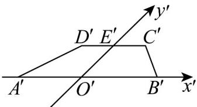
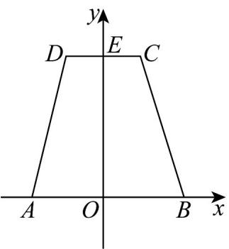

> [!faq]- 《专题13_立体图形的直观图_高效培优期中专项训练_数学人教A版高一必修》官方解析
>
> > [!success]- **【答案】** $10\sqrt{2}$
>
> > [!note]- **【解析】**
> > 运用斜二测画法根据直观图画出原图，如下，
> >
> > 
> >
> > 
> >
> > 梯形 $A'B'C'D'$ 的面积为 $^{30}$ ， $A'B' = 2C'D' = 8$ ，则原图梯形的高为 $h$
> >
> > 即 $30 = \frac{4 + 8}{2} h$ ，解得 $h = 5\cdot \angle E^{\prime}OB = 45^{\circ}$ ，则 $E^{\prime}O = \frac{5}{\sin 45^{\circ}} = 5\sqrt{2}$
> >
> > 根据直观图与原图的长度关系，知道原图高为 $EO = 2 \times 5\sqrt{2} = 10\sqrt{2}$
> >
> > 故答案为： $10\sqrt{2}$
