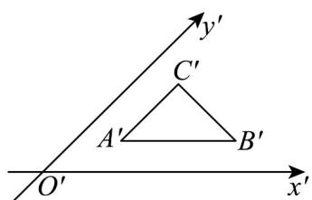
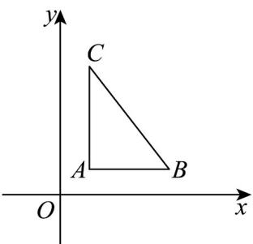

> [!faq]- 《专题13_立体图形的直观图_高效培优期中专项训练_数学人教A版高一必修》官方解析
>
> > [!success]- **【答案】**  A. $1 + \sqrt{2} +\sqrt{3}$ B. $4 + 2\sqrt{2}$ C. $2 + \sqrt{2} + \sqrt{6}$ D. $2 + 2\sqrt{2} + 2\sqrt{3}$
>
> > [!note]- **【解析】**
> > 
> >
> > 根据题意， $A'B' / / x'$ 轴， $A'C' / / y'$ 轴，故 $\angle C'A'B' = 45^{\circ}$
> >
> > 又 $B^{\prime}C^{\prime} = A^{\prime}C^{\prime} = 1$ ，则 $\angle A^{\prime}C^{\prime}B^{\prime} = 90^{\circ}$ ， $A^{\prime}B^{\prime} = \sqrt{2}$
> >
> > 在平面图直角坐标系 $xoy$ 中，有 $\angle CAB = 90^{\circ}$
> >
> > 于是， $AC = 2A'C' = 2$ ， $AB = A'B' = \sqrt{2}$ ， $BC = \sqrt{AB^2 + AC^2} = \sqrt{6}$ ，
> >
> > 所以 VABC 的周长为 $AC + AB + BC = 2 + \sqrt{2} + \sqrt{6}$ .
> >
> > 故选：C.
> >
> > ## 考点02斜二测法画立体图形的直观图
