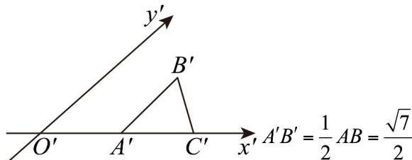

> [!faq]- 《专题13_立体图形的直观图_高效培优期中专项训练_数学人教A版高一必修》官方解析
>
> > [!success]- **【答案】** A. $\frac{3\sqrt{7}}{2}$ B. $\frac{3\sqrt{14}}{8}$ C. $\frac{3\sqrt{2}}{2}$ D. $\frac{3\sqrt{21}}{8}$
>
> > [!note]- **【解析】**
> > 根据题意，VABC 中， $A=90^{\circ}$ ，AC=3，AB=4
> >
> > 由勾股定理得 $AB = \sqrt{4^2 - 3^2} = \sqrt{7}$
> >
> > 在直观图 $\triangle A'B'C'$ 中，
> >
> > 
> >
> > $$
> > A ^ {\prime} C ^ {\prime} = A C = 3
> > $$
> >
> > 故 $\triangle A'B'C'$ 的面积 $S = \frac{1}{2}\left|A'B'\right|\times \left|A'C'\right|\sin 45^{\circ} = \frac{1}{2}\times \frac{\sqrt{7}}{2}\times 3\times \frac{\sqrt{2}}{2} = \frac{3\sqrt{14}}{8}.$
> >
> > 故选 **B**
