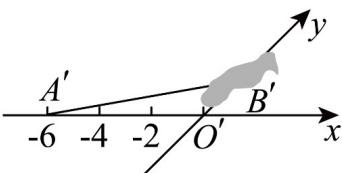
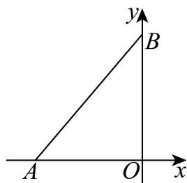

> [!faq]- 《专题13_立体图形的直观图_高效培优期中专项训练_数学人教A版高一必修》官方解析
>
> > [!success]- **【答案】**  A. 1 B. 2 C. 3 D. 4
>
> > [!note]- **【解析】**
> > 画出VAOB的原图为直角三角形，且 $OA = O'A' = 6$
> >
> > 因为 $\frac{1}{2}OB \times OA = 12$ ，所以 OB = 4，所以 $O'B' = \frac{1}{2}OB = 2$ .
> >
> > 
> >
> > 故选 **B**
