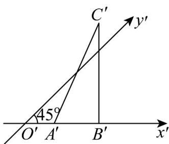
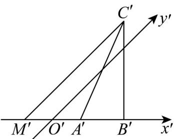

> [!faq]- 《专题13_立体图形的直观图_高效培优期中专项训练_数学人教A版高一必修》官方解析
>
> > [!success]- **【答案】**  A. 2 B. 4 C. $4\sqrt{2}$ D. 8
>
> > [!note]- **【解析】**
> > 如图，过 $C'$ 作 $C'M'//y'$ 轴，交 $x'$ 轴于 $M'$ ，
> >
> > 在 $\triangle C'M'B'$ 中，因为 $B'C'$ 与 $x'$ 轴垂直，且 $B'C' = 2\sqrt{2}$ ， $\angle C'M'B' = 45^\circ$
> >
> > 所以 $C^{\prime}M^{\prime} = \frac{B^{\prime}C^{\prime}}{\sin 45^{\circ}} = \frac{2\sqrt{2}}{\frac{\sqrt{2}}{2}} = 4$
> >
> > 由斜二测画法知： $CM = 2C'M' = 8$ ，所以 VABC 的边 AB 上的高为 8.
> >
> > 故选：D.
> >
> > 
