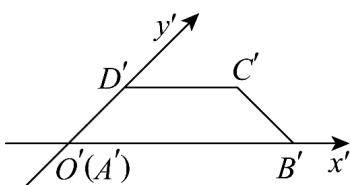
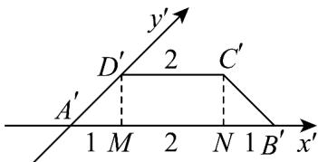
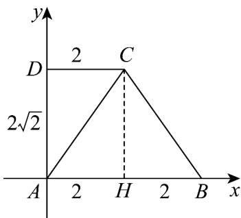

> [!faq]- 《专题13_立体图形的直观图_高效培优期中专项训练_数学人教A版高一必修》官方解析
>
> > [!success]- **【答案】**  A. $A^{\prime}D^{\prime} = 2\sqrt{2}$ B. $AB = 4$ C．四边形ABCD的面积为 $6\sqrt{2}$ D．四边形ABCD的周长为 $6+\sqrt{6}+\sqrt{2}$
>
> > [!note]- **【解析】**
> > $^{A}$ 选项，过点 $C'$ ， $D'$ 作 $C'N$ ， $D'M$ 垂直于 $x'$ 轴于点N，M，
> >
> > 因为等腰梯形 $A'B'C'D'$ 中 $A'B' = 4$ ， $C'D' = 2$
> >
> > 所以 $MN = 2$ ， $A^{\prime}M = B^{\prime}N = 1$
> >
> > 又 $\angle D^{\prime}A^{\prime}M = 45^{\circ}$ ，所以 $A^{\prime}D^{\prime} = \sqrt{2}$ ，A错误；
> >
> > 
> >
> > B 选项，由斜二测法可知 $AB = A'B' = 4$ ，B 正确；
> >
> > C 选项，作出原图形，可知 $AD = 2A'D' = 2\sqrt{2}$ ， $AB = 4$ ， $CD = 2$ ， $AD \perp AB$
> >
> > 故四边形 $ABCD$ 的面积为 $\frac{(CD + AB) \cdot AD}{2} = 6\sqrt{2}$ ，C 正确；
> >
> > 
> >
> > $^{D}$ 选项，过点 C 作 $CH \perp AB$ 于点 H ，
> >
> > 则 $AH = CD = 2$ ， $BH = 4 - 2 = 2$ ， $CH = AD = 2\sqrt{2}$
> >
> > 由勾股定理得 $BC = \sqrt{BH^2 + CH^2} = 2\sqrt{3}$
> >
> > 四边形 $ABCD$ 的周长为 $AB + CD + AD + BC = 4 + 2 + 2\sqrt{2} + 2\sqrt{3} = 6 + 2\sqrt{2} + 2\sqrt{3}$ ，D 错误.
> >
> > 故选 **BC**.
