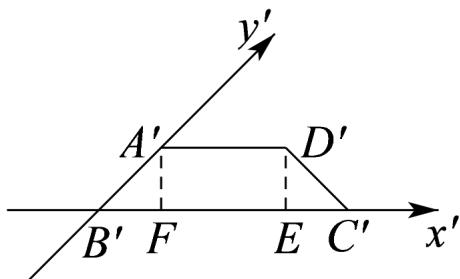

> [!faq]- 《专题13_立体图形的直观图_高效培优期中专项训练_数学人教A版高一必修》官方解析
>
> > [!success]- **【答案】** C
>
> > [!note]- **【解析】**
> > 如图，作出对应的 $x'$ 轴， $y'$ 轴，使 $\exists x \notin B \notin y \notin = 45^\circ$
> >
> > 
> >
> > 由题意得， $A^{\prime}D^{\prime} / / B^{\prime}C^{\prime},B^{\prime}C^{\prime} = 2A^{\prime}D^{\prime} = 2,A^{\prime}B^{\prime} = \frac{1}{2} AB = \frac{\sqrt{2}}{2}$
> >
> > 作 $A^{\prime}F\perp B^{\prime}C^{\prime}$ 于点 $F$ ，作 $D^{\prime}E\perp B^{\prime}C^{\prime}$ 于 $E$ ，则四边形 $A^{\prime}D^{\prime}EF$ 为矩形，且 $A^{\prime}F = A^{\prime}B^{\prime}\sin 45^{\circ} = \frac{\sqrt{2}}{2}\times \frac{\sqrt{2}}{2} = \frac{1}{2}$
> >
> > 由 $\Phi A\Phi B\Phi F = 45^{\circ}$ 得 $\triangle A'B'F$ 为等腰直角三角形，故 $B\Phi F = A\Phi F = \frac{1}{2}$ .
> >
> > 由四边形 $A^{\prime}D^{\prime}EF$ 为矩形得， $A^{\prime}D^{\prime} = EF = 1, A^{\prime}F = D^{\prime}E = \frac{1}{2}$
> >
> > 所以 $C\Phi E = B\Phi C\Phi - B\Phi F - EF = \frac{1}{2}$ ，故 $C\Phi D\Phi = \sqrt{C\Phi E^{2} + D\Phi E^{2}} = \sqrt{\frac{\Phi}{\Phi} \frac{\Phi}{2} \frac{\ddot{\Phi}}{\dot{\Phi}} + \frac{\Phi}{\Phi} \frac{\ddot{\Phi}}{2} \frac{\ddot{\Phi}}{\dot{\Phi}}} = \frac{\sqrt{2}}{2}$ ，
> >
> > 所以四边形 $A'B'C'D'$ 的周长为 $A'B' + B'C' + C'D' + A'D' = \frac{\sqrt{2}}{2} + 2 + \frac{\sqrt{2}}{2} + 1 = 3 + \sqrt{2}$ .
> >
> > 故选 **C**.
