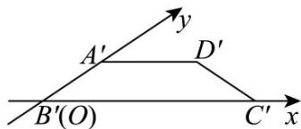

<!-- question-source:start -->
14. 某水平放置的平面图形 $ABCD$ 的斜二测直观图是梯形 $A'B'C'D'$ （如图），已知 $A'D' // B'C'$ ，

$\angle A'B'C' = 45^{\circ}$ ， $A^{\prime}D^{\prime} = A^{\prime}B^{\prime} = \frac{1}{2} B^{\prime}C^{\prime} = 1$ ，将该平面图形绕其直角腰 $AB$ 边旋转一周得到一个圆台，则该圆台的侧面积为

<!-- question-source:end -->

![[高中/课堂同步/题库/人教A版高中数学同步讲义(2026)/02_必修第二册/期中专项训练+期中模拟卷/专项训练/专题14_简单几何体的表面积和体积_高效培优期中专项训练_数学人教A版/_compact/answers/Q00064113A1.md]]
