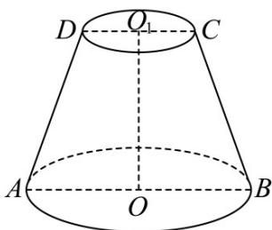

<!-- question-source:start -->
24. 如图，已知圆台的轴截面为梯形 $ABCD, AB = 4, CD = 2$ ，梯形 $ABCD$ 的面积为 $6\sqrt{2}$ .

(1)求圆台的体积；

(2)在圆台的侧面上，从点 $A$ 到点 $C$ 的最短路径长度是多少？
<!-- question-source:end -->

![[高中/课堂同步/题库/人教A版高中数学同步讲义(2026)/02_必修第二册/期中专项训练+期中模拟卷/专项训练/专题14_简单几何体的表面积和体积_高效培优期中专项训练_数学人教A版/_compact/answers/Q00064121A1.md]]
