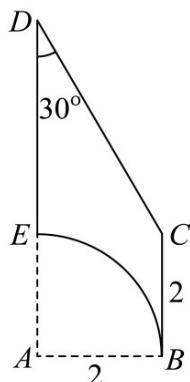

<!-- question-source:start -->
41. 在一个如图所示的直角梯形 $ABCD$ 内挖去一个扇形， $E$ 是梯形的下底边上的一点，将所得平面图形绕直线 $DE$ 旋转一圈。

(1)说明所得几何体的结构特征；

(2)求所得几何体的表面积和体积.
<!-- question-source:end -->

![[高中/课堂同步/题库/人教A版高中数学同步讲义(2026)/02_必修第二册/期中专项训练+期中模拟卷/专项训练/专题14_简单几何体的表面积和体积_高效培优期中专项训练_数学人教A版/_compact/answers/Q00064131A1.md]]
