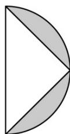

<!-- question-source:start -->
63．如图，半径为 $4 \, cm$ 的半圆剪去一个以直径为底的等腰直角三角形，将剩余部分以半圆的直径为轴旋转一周，所得几何体的体积是 \_\_\_\_ $cm^{3}$ .

<!-- question-source:end -->

![[高中/课堂同步/题库/人教A版高中数学同步讲义(2026)/02_必修第二册/期中专项训练+期中模拟卷/专项训练/专题14_简单几何体的表面积和体积_高效培优期中专项训练_数学人教A版/_compact/answers/Q00064145A1.md]]
