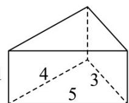
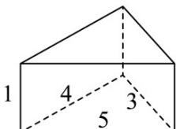
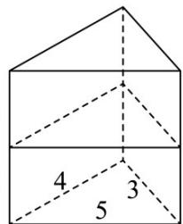
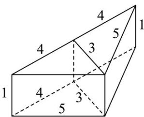
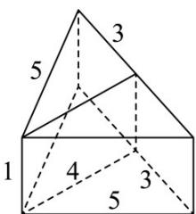

> [!faq]- 《专题14_简单几何体的表面积和体积_高效培优期中专项训练_数学人教A版》官方解析
>
> > [!success]- **【答案】**   A 36 B 38 C 40 D 42
>
> > [!note]- **【解析】**
> > 当拼成三棱柱时有三种情况，如图①②③，表面积分别为 $S_{1}=2\times6+2\times(5+4+3)=36, S_{2}=4\times6+2\times(5+4)=42, S_{3}=4\times6+2\times(5+3)=40.$
> >
> > 故选：B.
> >
> > 
> > 图①
> >
> > 
> > 图②
> >
> > 
> > 图③
