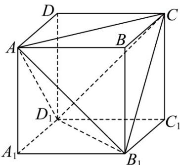

> [!faq]- 《专题14_简单几何体的表面积和体积_高效培优期中专项训练_数学人教A版》官方解析
>
> > [!success]- **【答案】**  A. $\sqrt{3}:1$ B. $1:\sqrt{2}$ C. $\sqrt{6}:2$ D. $1:\sqrt{3}$
>
> > [!note]- **【解析】**
> > 设正方体的棱长为 a，则正方体的表面积是 $6a^{2}$ ，
> > 正四面体 $A - B_{1}CD_{1}$ 的棱长为 $\sqrt{2}a$ ，它的表面积是 $4 \times \frac{1}{2} \times (\sqrt{2}a)^{2} \times \frac{\sqrt{3}}{2} = 2\sqrt{3}a^{2}$ ，
> > 因此正四面体的表面积与正方体的表面积之比为 $1:\sqrt{3}$ .
> >
> > 故选 **D**.
