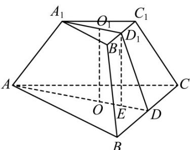

> [!faq]- 《专题14_简单几何体的表面积和体积_高效培优期中专项训练_数学人教A版》官方解析
>
> > [!success]- **【答案】** A. $27\sqrt{3}\ cm^{2}$ B. $\frac{27\sqrt{3}}{2}\ cm^{2}$ C. $\frac{\sqrt{3}}{2}\ cm^{2}$ D. $\sqrt{3}\ cm^{2}$
>
> > [!note]- **【解析】**
> > 如图， $O_{1}$ ，O分别是上、下底面中心，则 $O_{1}O=\frac{3}{2}\ cm$ ，
> >
> > 
> >
> > 连接 $A_{1}O_{1}$ 并延长交 $B_{1}C_{1}$ 于点 $D_{1}$ ，连接 $AO$ 并延长交 $BC$ 于点 $D$ ，连接 $DD_{1}$ ，过 $D_{1}$ 作 $D_{1}E \perp AD$ 于点 $E$ ，在 Rt△ $D_{1}ED$ 中， $D_{1}E = O_{1}O = \frac{3}{2}\mathrm{cm}$ ， $DE = DO - OE = DO - D_{1}O_{1} = \frac{1}{3} \times \frac{\sqrt{3}}{2} \times (6 - 3) = \frac{\sqrt{3}}{2} (\mathrm{cm})$ ，
> >
> > 所以 $DD_{1} = \sqrt{D_{1}E^{2} + DE^{2}} = \sqrt{\left(\frac{3}{2}\right)^{2} + \left(\frac{\sqrt{3}}{2}\right)^{2}} = \sqrt{3} (\mathrm{cm})$
> >
> > 所以 $S_{\text{正三棱台侧}} = 3 \times \frac{1}{2} (BC + B_1C_1) \cdot DD_1 = \frac{27\sqrt{3}}{2} (\mathrm{cm}^2)$
> >
> > 故选 **B**
